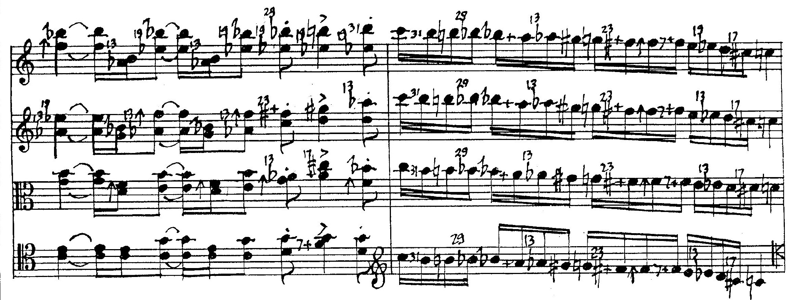

# FJS Compared With Alternatives

The FJS is not the only JI notation system in existence. Many composers make microtonal music independently and so a large number of idiosyncratic notation systems for many different microtonal scales have been invented. The overwhelming majority of these notation systems, however, is optimized for one particular aspect of microtonality, such as one particular microtonal division of the octave, and is inadequate for JI notation.

The FJS has been constructed specifically with JI in mind, and while it is very adequate for JI notation, it can hardly notate anything else. **Two other widespread notation systems with similar goals exist:** the Helmholtz-Ellis notation system and Ben Johnston's notation system.

There also exists one particular notation system I will omit here. It is Sagittal, which was created with all of microtonal music in mind. I will not be considering Sagittal because it relies entirely on representing pitch, meaning that – regardless of the relative accuracy of its accidentals – it will always be ambiguous when representing JI, because JI intervals are infinitely dense.

The Helmholtz-Ellis notation (sometimes extended to HEWM, Helmholtz-Ellis-Wolf-Monzo) system was the first attempt to extend staff notation to notate JI. Marc Sabat has created [the most recent extension](http://www.marcsabat.com/pdfs/notation.pdf) I could find, which can represent JI up to the 61-limit.

On the other hand, Ben Johnston's notation system was created by one person, JI composer Ben Johnston. [The most exhaustive article](https://www.jstor.org/stable/833435) about this system lists accidentals up to the 31-limit. So does [Kyle Gann's guide](https://kylegann.com/BJNotation.html).

Here, I will compare both of these systems to the FJS.

## The Natural Notes

Helmholtz-Ellis, like the FJS, assumes that default staff notation represents Pythagorean tuning. This way, as in the FJS, every Pythagorean interval corresponds to exactly one traditional interval class, and every fifth is tuned as 3/2. Up to this point, Helmholtz-Ellis is identical to the FJS. As in the FJS, this promotes consistency and a notation based on intervals, rather than specific pitch classes.

Ben Johnston, on the other hand, does something a little more… innovative. It differs in its definitions of the natural notes and accidentals. Traditional staff notation has the following meaning in Ben Johnston notation:

- F – C – G – D is a chain of perfect fifths (3/2).
- F – A, C – E, and G – B are 5/4 major thirds.
- The standard sharp and flat represent accidentals of 25/24 (a Pythagorean chromatic semitone minus two syntonic commas; A125).

(A syntonic comma is 81/80.)

This is done, I presume, so that C–E–G, F–A–C and G–B–D are all 4:5:6 major triads, and C–E♭–G, F–A♭–C and G–B♭–D are all 10:12:15 minor triads. Hence we get C–D–E–F–G–A–B–C as Ptolemy's intense diatonic or just major scale, and C–D–E♭–F–G–A♭–B♭–C as the just minor scale.

I assume therefore that the alleged goal is to make the notation of 5-limit music based on diatonic harmony easier, at the cost of literally everything else.

But this is not the case; even 5-limit diatonic harmony becomes harder to write this way. D–A is not a perfect fifth; it is 40/27. The same is true for the transition fifth B–F♯ or B♭–F. This means that Johnston's accidentals for the syntonic comma (pluses and minuses for upward and downward motion respectively) are found absolutely everywhere. On the Tonalsoft microtonal music [encyclopedia entry](http://www.tonalsoft.com/enc/j/johnston.aspx) for Johnston notation, Joe Monzo writes:

> *It is the opinion of several tuning-theorists that Johnston's notational idea is a good one, but that it could be improved by using a Pythagorean scale instead of a 5-limit one as a basis.*

In fact, the inconsistency of the natural notes causes an absolute avalanche of problems in Johnston's notation, and don't be surprised that I'll keep referring back to this main issue virtually throughout the rest of this discussion.

Johnston's notation is extremely biased in its notation: particularly for 5-limit music in the diatonic scale. Worse even, 5-limit music in the **C major** scale. Don't even mention D major, let alone D minor! And all that despite the fact that when listing [reasons for composing in JI](https://www.kylegann.com/JIreasons.html), Kyle Gann explicitly **denies** that just intonationists "*apparently like our music all simple and pretty and full of major triads and uninteresting.*"

Music that contains no factors of five, such as La Monte Young's Well-Tuned Piano tuning (which famously only makes use of the prime factors 2, 3, and 7), requires lots of syntonic commas in its Johnston representation, even though not a single factor of 5 appears in the tuning. This is quite simply absurd. (The bottom of this page lists many such comparisons.)

It is virtually impossible to transpose in Johnston notation. A piece written in Helmholtz-Ellis or the FJS can easily be transposed up by a 3/2 fifth by simply changing the Pythagorean parts of the note names, and keeping all microtonal accidentals unchanged. It can even be easily transposed by a non-Pythagorean interval, like 5/4: just transpose by 81/64 and then add +5 to all notes. In contrast, a piece written in Johnston notation cannot be easily transposed by any Pythagorean or 5-limit (let alone more complicated) interval. If the piece is originally in G, then transposing it to D would additionally require adding a syntonic comma accidental (a plus) to every A, because G–D (3/2) is not the same interval as D–A (40/27), and adding an inverse syntonic comma (a minus) to every F, because G–B♭ (6/5) is not the same as D–F (32/27). Transposing instruments would need to have their part completely rewritten with countless additional pluses and minuses, even if the interval they deviate by is as simple as a whole tone (9/8)! This is clearly seen in Kyle Gann's guide, which lists **seven** different versions of the 16–32 portion of the harmonic series, depending on the tonic!

Note: *Kyle Gann has written an interesting counterpoint to this issue in his guide to Johnston notation. I respond to it directly at the bottom of this page.*

One point for Helmholtz-Ellis and the FJS.

> **FJS: 1, HE: 1, Johnston: 0.**

## Choice of Accidentals

Both Helmholtz-Ellis and Johnston, like the FJS, write the remainder of just intonation using accidentals that represent commatic shifts.

Here is the list, up to the 61-limit, for Helmholtz-Ellis:

- 81/80, a 5-comma.
- 64/63, a 7-comma.
- 33/32, an 11-comma.
- 27/26, a 13-comma.
- 256/255, a 17-comma with a factor of five.
- 513/512, a 19-comma.
- 736/729, a 23-comma.
- 145/144, a 29-comma with a factor of five.
- 1024/1023, a 31-comma with a factor of eleven.
- 297/296, a 37-comma with a factor of eleven.
- 6561/6560, a 41-comma with a factor of five.
- 129/128, a 43-comma.
- 2304/2303, a 47-comma with a factor of forty-nine.
- 160/159, a 53-comma with a factor of five.
- 768/767, a 57-comma with a factor of thirteen.
- 1281/1280, a 61-comma with a factor of seven and five.

A few of these accidentals coincide with those of the FJS: 5, 7, 11, 19, 23, and 43.

What stands out most is that the accidentals for 17, 29, 31, 37, 41, 47, 53, 57, and 61 involve factors other than 2, 3, and the prime in question. The only ones left over are the ones that coincide with the FJS, plus 13. (Among the primes between 32 and 64, only one of them – 43 – has no extraneous factors.)

Why is this a problem? While these can still be represented, they require two accidentals combined from two different primes, which is unnecessarily confusing. It seems as though all commas after the 23-comma were specifically selected to be a ratio of the form $$\frac{n+1}{n}$$ (referred to as superparticular), often at the cost of having a complicated prime factorization. (What is particularly notable is that such a form does not even guarantee that the resulting comma is small. One famous comma in microtonal music theory, 1029/1024, the difference between a 3/2 fifth and three 8/7 septimal whole tones, is not of this form, yet it is particularly small.)

Helmholtz-Ellis, rejecting these commas, starts reusing primes and needlessly complicates the representation of higher JI intervals. For example, representing 17/16 requires one to write 16/15 modified by 256/255, and 16/15 itself is 256/243 modified by 81/80. Using two accidentals for a simple prime interval? Mercifully, no prime interval up to the 61-limit requires *three* or more accidentals.

There also is a huge imbalance between comma sizes; 27/26 is a huge 13-comma in comparison to the tiny 6561/6560 for the 41-comma.

What about Ben Johnston, then? Here is the list up to the 31-limit:

- 81/80, a 5-comma, which does not quite have the same status as an accidental, it's more of an adjustment (because Johnston's notation is riddled with syntonic commas).
- 35/36, a 7-comma with a factor of five.
- 33/32, an 11-comma.
- 65/64, a 13-comma with a factor of five.
- 51/50, a 17-comma with a factor of twenty-five.
- 95/96, a 19-comma with a factor of five.
- 46/45, a 23-comma with a factor of five.
- 145/144, a 29-comma with a factor of five.
- 31/30, a 31-comma with a factor of five.

Of course, all of these accidentals save the 11-comma have factors of five, and the 17-comma even has a double factor of five. This is probably an adjustment for the abundance of factors of five in Johnston's notation, so it's almost as if these commas are an attempt at correcting Johnston's mistake of mapping the natural notes to the Ptolemaic sequence. The abundance of superparticular commas is also notable, but seems to be coincidental in this case.

These factors cannot receive quite the same criticism as they do in Helmholtz-Ellis; they are quite logical in the context of the illogical choice of natural notes. 65/64 maps 8/5 to 13/8; 51/50 maps 25/24 to 17/16; 46/45 maps 45/32 to 23/16. They map simple 5-limit intervals to the primes.

The FJS is similar to Johnston in this respect; it always maps Pythagorean tuning to the primes, without any extraneous factors.

One point for Johnston and the FJS.

> **FJS: 2, HE: 1, Johnston: 1.**

## Origin of Accidentals

Where do these accidentals come from, then?

The answer is quite simple: neither Helmholtz-Ellis nor Johnston give any reason.

Helmholtz-Ellis has 81/80 (the **syntonic comma**) and 64/63 (the **septimal comma**), which I assume are due to their historical importance. 33/32 and 27/26 also seem familiar as quarter-tone-esque intervals typical for the 11- and 13-limit respectively. The 17- and 19-comma are based on superparticular coincidences with powers of 2: 256/255 and 513/512 respectively. The 23-comma and 43-comma are the same as in the FJS. The rest of the commas seem quite random, like the result of a blind search for superparticular ratios within the harmonic series.

Johnston has 81/80 obviously to counter its own inconsistency, but the remaining commas are not recognizable, since they are mappings from the 5-limit to the prime intervals, and some of these mappings are indeed quite odd. One would think that a comma such as 256/255 would rather show up in Johnston than in Helmholtz-Ellis; but no, Johnston uses 51/50, which maps the *chromatic* rather than the diatonic semitone to 17/16.

Why is the question of the origin of accidentals important at all? In the FJS, all the commas are generated by an algorithm. Not so in Helmholtz-Ellis or Johnston. This means that the list must be memorized, or else constantly looked up. Having no access to these lists, one cannot even start.

For the FJS, this is one of the three most important advantages from using an algorithm. This is the equivalent of being “culturally neutral” in that respect.

One point for the FJS, half a point for Helmholtz-Ellis.

> **FJS: 3, HE: 1.5, Johnston: 1.**

## Form of Accidentals

Let's have a look at how to actually write these accidentals, then.

Helmholtz-Ellis has a dedicated list by Marc Sabat and Wolfgang von Schweinitz, [which can be seen here](http://www.marcsabat.com/pdfs/fulllegendE.pdf).

What's this? A unique glyph for each limit that has nearly no relation at all to the limit itself? Gee, yet another series of arbitrary shapes to memorize or constantly look up…

The only relation I could find between these shapes and the commas they represent was by inspection. Helmholtz-Ellis divides its accidentals into four categories by size, descending: third-tones, quarter-tones, commas, and schismas. There only is one third-tone (27/26) and only one quarter-tone (33/32); these take alterations of the traditional quarter-tone accidentals. Schismas up to the 31-limit take slashes and backslashes, or pluses and minuses, while commas take arrows. From 32 to 64, curly brackets are used around existing accidentals, again with no visible relationship.

5-limit accidentals additionally behave completely differently from the rest. Instead of being independent, they attach to Pythagorean accidentals. This means that it's impossible to indicate a 5-limit accidental without also writing a Pythagorean one. This is a little inconvenient, but not too much. In C major, writing a natural in front of an E just to attach a downward arrow to it seems a little weird, but it's not a huge downside.

Ben Johnston performs much, much better. While his commas remain a fixed list, the symbols for these commas are predictable from the 13-limit onwards. Only the following accidental forms are arbitrary: the 5-limit uses a plus and minus for a syntonic comma, the 7-limit uses a digit 7 shaped arrow (the same as in Helmholtz-Ellis) for 35/36, and the 11-limit uses an up or down arrow for 33/32. (Johnston's 7-limit accidental can also attach to sharps and flats, but unlike with Helmholtz-Ellis, this is not a disadvantage because this combination is not mandatory.)

Every accidental from the 13-limit onwards uses just the prime number itself for the positive adjustment… (yay, off to such a good start!)

…and the prime number *upside down* for the negative adjustment. Seriously? The only reason why this is not a **very serious** problem is because the 11-limit is notated with a special accidental and not the number “11”, which looks the same when written upside down if the digit 1 is written as a vertical line. If not, then the first prime with this problem is 686989.

The FJS uses the number itself to represent all accidentals, they are negated by attaching a stroke in front, and they are merged by multiplication. I assume Johnston's accidentals would merge simply by concatenation (which cannot be split unambiguously; 137 is prime, and the concatenation of the prime numbers 13 and 7; thanks to reader Volleo 6144 for pointing this out to me). However, I have never seen a note in Johnston's writings that had to be modified by more than one numerical accidental.

One point for the FJS, half a point for Johnston.

> **FJS: 4, HE: 1.5, Johnston: 1.5.**

## Behavior of Accidentals

Let's look at how the accidentals themselves behave. In other words, how do they modify the notes they precede?

In Helmholtz-Ellis, all positive accidentals are upward and all negative accidentals are downward. This is a generalization of the notion that a sharp raises the pitch and a flat lowers it.

In Ben Johnston, excluding 81/80, all positive accidentals are otonal and all negative accidentals are utonal. This is a generalization of the notion that a sharp adds fifths to a pitch and a flat subtracts some.

In the FJS, positive accidentals are always otonal and negative accidentals are always utonal.

This might be the most controversial section in this comparison, because this particular point is where I cannot provide direct evidence for why I believe an otonality/utonality indication is better than a direction indication. All I can say is that after having invented the FJS (which initially used the positive-upward, negative-downward system) and used it to think about and analyze JI tunings, at some point I have suddenly arrived at the conclusion that the positive-upward, negative-downward system overcomplicates things and that I will immediately change it to positive-otonal, negative-utonal. It has drastically simplified my thinking in the FJS and has stayed that way ever since then. Therefore I may merely hope that you, the reader, will arrive at the same conclusion with experience.

Ben Johnston would be nearly tied with the FJS on this point, except the really annoying fact that 81/80 is exempt from its own rule. But due to the fact that 81/80 works differently from the other accidentals and is seen as an adjustment instead, and due to the fact that pluses and minuses really convey the idea of up and down, I will overlook this minor sin.

(If you think positive-upward and negative-downward is better, you may give Helmholtz-Ellis the point, instead of the FJS and Johnston. It won't make a big difference for determining the winner in the end.)

One point for Johnston and the FJS.

> **FJS: 5, HE: 1.5, Johnston: 2.5.**

## Note Naming

We will now look at another aspect: note naming (and by extension, interval naming). While both Helmholtz-Ellis and Johnston give this aspect minimal importance, the FJS actually *starts* from here and builds up to staff notation from note naming.

Given its arbitrary glyphs, note naming is practically impossible in Helmholtz-Ellis, unless one were to use either a completely different system or type using the dedicated Helmholtz-Ellis font. I have not seen any such attempt so far.

As for Johnston, its accidentals look promising to allow something like this. But Johnston notation also has a strange system of arbitrary division of its accidentals when it is used to name notes. Some Johnston accidentals are written between the diatonic pitch class and a Pythagorean accidental, but there is no rule which ones. For example, representing a septimal comma below E♭ requires one to write E7♭+ (sic). The septimal accidental goes between the E and the ♭, while the + required to adjust is then written after the ♭. What is most hurtful is that the deviation downwards by a septimal comma is, in Johnston notation, expressed using two accidentals, as “downwards by a syntonic plus septimal comma, but then upwards by a syntonic comma again”.

Johnston also has an elaborate system of pronunciation for its note names, which parallels that of the FJS but is much more complicated due to the 5-, 7-, and 11-commas having special glyphs. Kyle Gann gives “G-sharp-up-arrow-double-sub-seven-minus” as a possible note name. This is far more complicated than the most complicated possible note name in the FJS, consisting always of exactly (Pythagorean part)-(optional “super”)-(otonal)-(“sub”)-(utonal), in that order. Gann writes that the combinations of accidentals have not been standardized in Johnston notation.

Still, this system is better than nothing. Sigh.

Neither system has any evidence of interval naming, which is a direct translation of tonic-less JI ratios.

One point for the FJS, half a point for Johnston.

> **FJS: 6, HE: 1.5, Johnston: 3.**

## Scope and Precision

All three systems notate JI pitch-perfectly, there is no arbitrary precision. (This is why I did not consider Sagittal in this analysis. Sagittal, being a universal language for all microtonality, has fixed precision and anyway it is based on completely different principles, as it is not limited to JI.)

As for scope, I could say that the FJS comes in at first place, Helmholtz-Ellis second, and Johnston third. But this is pretty pointless; just comparing the raw numbers as of now. It's insignificant that Helmholtz-Ellis can represent the 61-limit, but Johnston can only do the 31-limit, because Johnston could easily assign additional commas to extend his notation all the way to the 127-limit if he wanted. What is significant is that the FJS can represent **all** of Just Intonation and that it can do it **now**. Moreover, following the current design, neither Helmholtz-Ellis nor Johnston will *ever* be able to represent as much JI as the FJS can. Extending the scope for those notation systems requires someone to sit down, inspect the harmonic series, and actually do the work. The FJS does this automatically, meaning it will always be ahead.

This is the second extremely important advantage that the FJS has from using an algorithm: it literally has no limits.

(Still, given how far ahead Helmholtz-Ellis is, it can have half a point.)

One point for the FJS, half a point for Helmholtz-Ellis.

> **FJS: 7, HE: 2, Johnston: 3.**

## Automatization

The third, and final, advantage from using an algorithm is that the FJS can be automated. Writing any JI ratio allows the FJS representation to be calculated given only the radius of tolerance. This will allow the FJS to be integrated into music software in the future.

Helmholtz-Ellis can also do this. The only minor complication is the fact that sometimes two accidentals must be used for one purpose. But it is possible to fully automate it without any problems. There even exists an [online calculator](https://www.plainsound.org/HEJI/) that does this.

As for Johnston? The same website has a [Johnston to HE converter](https://www.plainsound.org/HEJI/johnston.html), which works if you want to let a computer do it. But often when composing music, we don't want to have to use a calculator all the time.

One of the merits of the FJS is that its algorithms are easy to implement in your head and carry out instantly without any external tools, which makes using it much faster. But if you wanted to do the same in Johnston's notation…

> *For every 5 in the numerator: Ascend one major 3rd. (Add plus if starting on a D.)*
>
> *For every 7 in the numerator: Ascend one minor seventh and add a 7. (Add plus if starting on a G, B, or D.)*
>
> *For every 9 in the numerator: Ascend one major second. (Add plus if starting on an E, G, B, or D.)*
>
> *For every 11 in the numerator: Ascend one perfect fourth and add ↑. (Add minus if starting on an A or F.)*
>
> *For every 13 in the numerator: Ascend one minor sixth and add a 13. (Add minus if starting on an F.)*
>
> *For every 17 in the numerator: Add a sharp and a 17.*
>
> *For every 19 in the numerator: Ascend a minor third and add a 19. (Add plus if starting on a D.)*

This is just a fragment of the long list of rules required to derive the notation from JI ratios in Johnston notation, as given in Kyle Gann's guide.

What's especially agitating is the presence of extra rules for adding pluses or minuses if starting on very specific notes, which are different for every prime. (I do understand there is a deterministic relation between the interval and the notes on which pluses/minuses have to be added for said interval, but it still doesn't change the fact that this is a huge overcomplication!)

And yes, this is just an *excerpt* of the Johnston notation equivalent of something that can be summarized in a single concise algorithm in the FJS.

One point for Helmholtz-Ellis and the FJS.

> **FJS: 8, HE: 3, Johnston: 3.**

## Examples

All right, you may think, here's all this abstract analysis, but what about actual examples? How do the three systems perform *in practice*?

Below I've provided examples of actual common JI contexts, so it can be seen how all three systems compare in their efficiency within these contexts. (To name notes in Helmholtz-Ellis, I just use +5, +7, etc. for upward accidentals, and −5, −7, etc. for downward accidentals, to reflect its pitch notation.)

### The Harmonic Series 1-32

**FJS.** This table took me about a minute to write.

| C               | C               | G               | C              | E5   | G              | B♭7  | C |
| D               | E5   | F11  | G              | A♭13 | B♭7 | B5   | C |
| D♭17 | D               | E♭19 | E5  | F7   | F11 | F♯23 | G |
| G♯25 | A♭13 | A               | B♭7 | B♭29 | B5  | B31  | C |

**Helmholtz-Ellis.** This table took me roughly two minutes to write, being initially uncertain of my results. I used the calculator to verify them.

| C       | C    | G     | C    | E−5     | G    | B♭−7    | C |
| D       | E−5  | F+11  | G    | A−13    | B♭−7 | B−5     | C |
| D♭+5−17 | D    | E♭+19 | E−5  | F−7     | F+11 | F♯+23   | G |
| G♯−5−5  | A−13 | A     | B♭−7 | B♭+5+29 | B−5  | C−11−31 | C |

**Ben Johnston.** This table took roughly three minutes, given that I have actually seen this fragment of the harmonic series in Johnston's system before.

| C    | C    | G    | C   | E    | G   | B7♭   | C |
| D    | E    | F↑   | G   | A♭13 | B7♭ | B     | C |
| C♯17 | D    | E♭19 | E   | F7+  | F↑  | F♯23+ | G |
| G♯   | A♭13 | A+   | B7♭ | B♭29 | B   | B31   | C |

### La Monte Young's “Well-Tuned Piano”

**Young's notation.** (I write the scale as ascending, not as a sequence of keys on the keyboard, so G♯ comes before G as it is a lower pitch.)

> E♭, E, F, F♯, G♯, G, A, B♭, B, C♯, C, D, E♭.

**FJS.** Exactly as concise as Young, without relying on an arbitrary keyboard mapping. Also notates the tonic as its true pitch with reference to A = 440 Hz, the tuning of Young's piano.

> D7, E, E7, F7, G7, G, A, A7, B♭7, C7, C, D, D7.

Here is what it would be if it used E♭ to notate the tonic; a little less concise.

> E♭, F7, F, G♭49, A♭49, A♭7, B♭7, B♭, C♭49, D♭49, D♭7, E♭7, E♭.

**Helmholtz-Ellis.** Just as concise as the FJS on E♭.

> E♭, F−7, F, G♭−7−7, A♭−7−7, A♭−7, B♭−7, B♭, C♭−7−7, D♭−7−7, D♭−7, E♭−7, E♭.

**Ben Johnston.** Very inconcise. Also note the abundance of syntonic comma accidentals, in a tuning with no factor of five.

> E♭, F7++, F+, G77♭+, A77♭++, A7♭+, B7♭+, B♭, C77♭+, D77♭+, D7♭, E7♭+, E♭.

### Terry Riley's “Harp of New Albion”

**Riley's notation.**

> C♯, D, D♯, E, E♯, F♯, G, G♯, A, A♯, B, B♯, C♯.

**FJS.** The Pythagorean pitch classes match Riley's.

> C♯5, D, D♯5, E, E♯25, F♯5, G, G♯5, A, A♯25, B5, B♯25, C♯5.

**Helmholtz-Ellis.** On par with the FJS. Virtually identical.

> C♯−5, D, D♯−5, E, E♯−5−5, F♯−5, G, G♯−5, A, A♯−5−5, B−5, B♯−5−5, C♯−5.

**Ben Johnston.** Allegedly optimized for 5-limit harmony. This sequence took me about three minutes to correctly derive.

> C♯+, D, D♯+, E+, E♯+, F♯+, G, G♯+, A+, A♯+, B, B♯+, C♯+.

### Notation Comparison

This [comparison](../assets/compare/chorale.pdf) of the three systems in practice uses a 12-bar harmonization of a medieval melody in the Dorian mode on D in 5-limit just intonation. The fact that it's 5-limit should give Johnston's system an unfair advantage… well, see for yourself.

Listen to it:

<audio controls><source src="../assets/compare/chorale.mp3" type="audio/mpeg"></audio>

### More

You can find even more comparisons among the [examples](examples.html).

## Verdict

Unsurprisingly, the FJS is the best existing notation system for Just Intonation. Helmholtz-Ellis notation, unsurprisingly, is quite bad, being the first attempt at such a task. Johnston notation, given its absurd choice of the natural notes, is considerably worse than even Helmholtz-Ellis; its equal score is a result of figurative transfer error. The FJS significantly exceeds both Helmholtz-Ellis and Johnston notation in its task of notating JI.

## A Note to Kyle Gann

As mentioned, Kyle Gann's guide for Ben Johnston's system contains an addendum where he explains why he prefers Johnston over Helmholtz-Ellis despite its very inconvenient choice of natural notes.

You explain that finding the value of B♭ in the key of C is easier in Johnston than in Helmholtz-Ellis. In Johnston, C to B is 15/8, and adding a flat lowers it by 25/24, resulting in 9/5. In Helmholtz-Ellis, however, C to B is 243/128, and adding a flat lowers it by 2187/2048, and only a calculator can tell you that this results in 16/9. Considering consistency as one of the less important virtues, you dismiss Helmholtz-Ellis because apparently it will force you to constantly multiply and divide by four-digit numbers.

I respond to this argument because it relies on the fact that Helmholtz-Ellis notation, like the FJS, is based on the Pythagorean scale. So if this argument works against Helmholtz-Ellis, it should also work against the FJS.

I also respond because this argument is a non-sequitur.

Ben Johnston notation does force the user to constantly multiply and divide, because even the simplest notes are made of many factors of five juggled back and forth and adjusted for with pluses and minuses. Because the 5-limit scale is not consistent, it also forces the user to always think in terms of the seven diatonic pitches, rather than intervals.

When you attempt to use Helmholtz-Ellis notation, you automatically assume the same restrictions that you were bound to with Ben Johnston notation: trying to figure out the value of a minor seventh using a major seventh minus a chromatic semitone. You criticize Helmholtz-Ellis for the fact that one of these intervals now requires four-digit numbers to represent, while Johnston usually works with up to two-digit numbers.

The minor seventh is right next to you on the circle of fifths; it's just two perfect fourths, both 4/3 (again, unlike in Johnston, where C-F is 4/3 but F-B♭ is 27/20). Why would you go up five fifths (major seventh) to then immediately return seven fifths back (chromatic semitone)? Would you travel from North Carolina to South Carolina stopping by in Maine? You would say quite the opposite of G–(F♯)–F, which wouldn't be any different if you were using the FJS. Just because C writes its minor seventh with a flat doesn't mean that you have to think of it in those terms; you do this because Johnston forces you to. Take a modulation to any of G, D, A, E, or B. There, the minor seventh is a natural note, but unlike in Johnston notation, it still has the same size nonetheless.

Your guide to figuring out the ratios from notation does indeed start at looking at the natural notes and figuring out the interval between them. This is because this interval *depends* on the natural notes in Johnston notation, so there indeed is no other way to figure it out. For example, D to E is 10/9, which is different from C to D, 9/8. Helmholtz-Ellis and the FJS do not have this absurd restriction. Every major second is 9/8. This allows a composer to be freed from the restriction of the diatonic scale when thinking in JI, and it allows one to translate interval names directly to ratios.

You could have arrived at the fact that C to B♭ is 16/9 in so many different (and easier) ways than 243/128 times 2048/2187; in fact, you probably chose the most inconvenient possible way to arrive at 16/9 (the equivalent of the only possible way to arrive at 9/5 in Johnston).

For example, you could have noticed that both C and B♭ have no microtonal accidentals, so by the definition of the natural notes, the minor seventh between them is Pythagorean, hence 16/9. Or you could have noticed that it is two 4/3 fourths, hence 16/9. Or you could have noticed that it is the inversion of a 9/8 whole tone, hence 16/9. The FJS gives you such a freedom of quickly and efficiently reading and writing, as opposed to the slow, tedious process that Johnston enforces.

Here is an image of handwritten sheet music in Johnston notation (an excerpt from Ben Johnston's String Quartet No. 9) from your online guide:

In just two measures and four staves of music in C (the "best" key for Johnston notation!) on just the harmonic series segment 16-32, this excerpt contains not one, not two, but **three** mistakes: the viola in bar 1, measure 4 plays 99/64 instead of 11/8; all instruments but the first violin in bar 2, measure 4 play 39/32 instead of 19/16; and finally, the last two notes of the viola read 153/128, 9/8, instead of 17/16, 1/1. (All these ratios are octave-reduced with C as 1/1.)

It is not surprising that Johnston notation, being a cryptographic kaleidoscope, causes this much confusion while composing even in a key as simple as C (to say nothing of D or B♭).

In contrast, here is the same excerpt (mistakes included) in the FJS. Notice how much clearer and more apparent the mistakes become:

The way I see it, you are used to handcuffed maneuvers in Johnston notation, and are paralyzed when Helmholtz-Ellis (or the FJS) free you, because you got used to the handcuffs over the years of being handcuffed.

Switch to the FJS. It will make the math and notation part of your compositional pursuit **so much easier**.

Or don't, and continue juggling syntonic commas.

Others may have different criteria.
