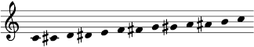
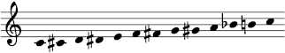
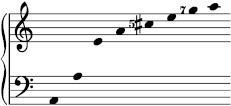
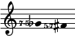

# The FJS Crash Course

So, you are intrigued by what the FJS has to offer, and would like to learn to use it.

This "crash course" was designed specifically with a focus on fast acquisition of all the fundamental elements of the system. It puts less focus on its shorthand system, which is not necessary. If you already have had exposure to Just Intonation, the FJS will be extremely easy for you to learn - you can learn it all in one sitting within a few minutes. Its beauty and simplicity are at your grasp.

## Introduction: Abandoning Enharmony

We are all familiar with standard staff notation and its conventional sharps and flats. But what we may not realize is that we learn staff notation as adapted for our omnipresent tuning system, twelve-tone equal temperament (from now on, this course will use the abbreviation 12-EDO, for Equal Divisions of the Octave).

For example, here is the 12-EDO chromatic scale:

No, wait. Actually, the way that it is most commonly written is like this:

Replacing that A♯ with B♭ makes no difference to us, of course. We know that those are different names for two notes that are of the same pitch. Choosing between these names is just a matter of legibility, or consistency, or simplicity, as given by context, but they are equivalent.

This property - that the interval of a diminished second be the same size as a perfect prime - has a name: enharmonic equivalence. In fact, musicians who are not familiar with (or aware of) alternate tuning systems may not even know that this property is not universal, and that 12-EDO is one of few tuning systems that satisfies it. In other tuning systems, there is no enharmonic equivalence or there is a different interval of the same size as the perfect prime. (For example, in 19-EDO, the perfect prime is the same size as the *double* diminished second, so E♯ and F♭ are actually equivalent.)

But let's not forget that staff notation predates even the thought of using 12-EDO (to say nothing of complete dominance) by many centuries. Staff notation was originally based on the diatonic scale, which - among its many simultaneous properties - also has the property of being generated from a stack of fifths (F-C-G-D-A-E-B). Actually, the very *fact* that staff notation has multiple ways to name the same pitch in 12-EDO implies that its original construction was based on something very different from 12-EDO.

In other words, enharmonic equivalence is the only 12-EDO feature in staff notation. Everything else is independent.

## Preliminary

Before you start learning about the FJS, there are three mathematical concepts that are FJS-specific that you must be acquainted with.

The first is the ability to quickly convert back and forth between an **interval in staff notation** (without enharmonic equivalence) and the **number of steps by fifths** which is required to build that interval. For example, a **major second** is **+2** fifths, because reaching the major second requires 2 steps by fifths in the clockwise direction: C-G-D. Similarly a **minor third** is **-3 fifths**, because reaching it requires 3 steps by fourths, which are fifths in the anticlockwise direction: C-F-B♭-E♭. Each interval in staff notation has one unique number of steps by fifths corresponding to it. You must be able to perform this conversion and the backwards conversion, ideally quickly.

The second is the ability to prime-factorize a rational number. Much like any **positive integer** can be uniquely factorized into primes with **natural number** exponents (this is the Fundamental Theorem of Arithmetic), any **positive rational number** can be uniquely factorized into primes with **integer** exponents. I will humorously dub this the Fundamental Theorem of Harmony. For example, the number 6/5 factorizes to 21 31 5-1 and no other factorization exists. (Given that this is a crash course, the mathematical details of this fact will be omitted, but of course [they are available](math.html) for the curious reader. Anywhere in this course where a mathematical fact is taken for granted, look for a proof in the mathematics page.)

The third is taking the reduced form of an interval. In practice, it consists of multiplying or dividing a number by 2 until the result is between 1 (inclusive) or 2 (exclusive); this process reflects our perception of *octave equivalence*, the tendency to perceive pitches off by an interval of 2/1 (the octave) as equivalent. For example, 7/1 becomes 7/4, and 1/6 becomes 4/3. The reduced form is given by the formula:

$$\text{red}(d)=d \cdot 2^{-\lfloor\log_2 d\rfloor}$$

Aside from that, you should also be familiar with cent measure for interval size. 100 cents is one 12-EDO semitone and 1200 cents is one octave. To calculate the cent size of an interval, use one of these formulae:

$$\displaystyle \text{C}(d)=\frac{1200 \cdot \log d}{\log 2} \text{ , where log is to an arbitrary base}$$

$$\text{C}(d)=\log_c d \text{ , where }c=\sqrt[1200]{2}$$

This is just about all you need, so let's get started!

## Lesson 1: Pythagorean Tuning

You might think that removing enharmonic equivalence from staff notation gives us access to a vastly larger number of pitches, and you would be correct. However, removing enharmonic equivalence, on its own, is insufficient to represent the entirety of JI in a meaningful way. One of the merits of JI is its ability to express very small differences in pitch to give different intervals different flavors.

Consider the sequence of JI intervals: 11/10, 10/9, 9/8, 8/7. Listen to it below:

<audio controls><source src="" type=""></audio>

All of them are "some type of major second" to most listeners, but it would be wrong to represent all of them with a major second in writing. They are very different intervals, and suppressing variety where it is the biggest virtue is contradicting the very essence of JI.

In that case, you might think that there might exist some middle ground, a subset of JI, which can be mapped exactly onto staff notation without enharmonic equivalence, and again you would be correct. That middle ground is none other than 3-limit JI, also known as Pythagorean tuning.

This means that the octave in staff notation is assigned the JI ratio 2/1, exactly the same as in 12-EDO, and that the perfect fifth in staff notation is assigned the JI ratio 3/2. With this assignment, every possible interval in staff notation is assigned exactly one possible 3-limit JI interval; there is a bijection.

This, actually, is how the set of diatonic pitch classes can be considered to be *defined*: F, C, G, D, A, E, and B are all defined such that F-C is 3/2, C-G is 3/2, etc. We notice that B-F can then be calculated to be 1024/729, which is close to 3/2 but is smaller. So we then define the sharp and flat to counter this difference, so that B-F♯ is 3/2 and B♭-F is 3/2. You will later see that the FJS works by extending this principle of countering differences with accidentals.

I should note that this requires something that some musicians may not be aware exists: multiples, beyond double, of the sharp and flat. While extremely rarely used in conventional music, they are required here so that the line of fifths is unbounded in either side. In the FJS, sharps and flats can appear with any multiplicity. This is not to say that they are common; just do not panic when you have to use them.

You are now ready to learn the first two FJS techniques.

> ### FJS Technique \#1: To convert from a Pythagorean ratio to an FJS representation.
> 
> 1. Factorize the ratio.
> 2. Initially ignore octaves (powers of two).
> 3. If the power of three is positive, move that many steps by fifths clockwise; if negative, move anticlockwise. Convert that number to an interval.
> 4. Adjust octaves as required.
>
> **Example:** To convert 9/8 to the FJS, we factorize: 2-3 32. We ignore the factor of two. The power of three is positive, so we move two fifths clockwise: C-G-D. We have a major second. No octave adjustment needs to be made. The answer is M2.

> ### FJS Technique \#2: To convert from an FJS representation of a Pythagorean ratio back to the ratio.
> 
> 1. Initially ignore octaves.
> 2. Convert the interval to the number of steps by fifths.
> 3. Raise three to that power and take the reduced form.
> 4. Adjust octaves as required.
>
> **Example:** To convert the FJS interval m3 to a Pythagorean ratio, we convert it first to -3 fifths: C-F-B♭-E♭. We now raise 3 to that power: 3-3. This is 1/27. To bring this number between 1 (inclusive) and 2 (exclusive), we multiply by 32 to get the answer: 32/27.

Below is a table of some common ones:

| Interval | Steps | Ratio       |
|---------:|:-----:|:------------|
| m2       | -5    | 256/**243** |
| m6       | -4    | 128/**81**  |
| m3       | -3    | 32/**27**   |
| m7       | -2    | 16/**9**    |
| P4       | -1    | 4/**3**     |
| P5       | +1    | **3**/2     |
| M2       | +2    | **9**/8     |
| M6       | +3    | **27**/16   |
| M3       | +4    | **81**/64   |
| M7       | +5    | **243**/128 |

You don't need to memorize this table. Memorization is not at all necessary to use the FJS. Instead, as with mental arithmetic, it's useful for speeding up your fluency. You should ideally be able to work out all these ratios given the intervals, and vice versa, on your own, given the two techniques listed above. Don't be afraid to use calculators to help you; you'll find one very useful when working with the FJS until you become fluent and simply know the common results.

### Exercise 1

1. Find the FJS intervals corresponding to the following Pythagorean ratios: 2187/2048, 1024/729, 8192/6561.
2. Find the Pythagorean ratios corresponding to the following FJS representations: d7, A5, d3.
3. Find the Pythagorean ratios between consecutive steps in this scale: 
4. Notate this scale in the FJS with D as tonic: 1/1, 81/64, 4/3, 3/2, 243/128, 2/1.
5. Find the ratio of the Pythagorean comma (d2 in the FJS).
6. (HARD!) One particularly small interval in Pythagorean tuning, only about 3.6 cents, has the ratio 353/284. Find its FJS representation.

You can check your answers [here](solutions.html).

## Lesson 2: The Prime Intervals

All right, you've learned to write all of Pythagorean tuning. This is pretty boring for now, since Pythagorean doesn't even deviate from 12-EDO that much - aside from having a nonzero diminished second. And more importantly, it's not even close to being able to notate the entirety of Just Intonation.

The next step in being able to cover all of JI is to cover the so-called prime intervals. These are intervals in the overtone series based on prime numbers. To find them, we take the prime numbers:

> 2, 3, 5, 7, 11, 13, 17, 19, ...

...and we take the reduced form of all of them:

> 1/1, 3/2, 5/4, 7/4, 11/8, 13/8, 17/16, 19/16, ...

We already know how to notate the first two primes: the octave and the fifth. Those are covered. In fact, from this point onwards, when I refer to "prime intervals", I refer exclusively to the ones corresponding to primes greater than 3.

Now, if you are familiar with JI, then you might have heard of 5/4 being called a "just major third" and 7/4 being called a "harmonic seventh" - a form of "minor seventh". Chances are, this language may not have seemed strange to you at first glance. These just seem like innocent extensions of the notion of "major third" and "minor seventh" to include intervals that are close to those interval classes.

But if we consider this on a formal level, things start to get weird.

Say we accept this at first: 5/4 is a type of major third. So we'll notate it as a major third, with some kind of additional symbol indicating the deviation. The difference from the Pythagorean major third, 81/64, is the small interval of 81/80, about 22 cents. This should be fine, why would it be problematic? The reason is because the Pythagorean diminished fourth, 8192/6561, is *much* closer. The difference between that and 5/4 is only 32805/32768, only about 2 cents!

Why should we choose the major third over the diminished fourth to notate 5/4? Ah, simplicity, I hear you say. The major third is only +4 fifths, while the diminished fourth is the much more complicated -8 fifths. But then in that case, why don't we use the *minor* third to notate 5/4 - clearly it is simpler, only -3 as opposed to +4 fifths. Oh, it's too far away now? Who are *you* to decide the exactly correct balance between simplicity and proximity?

Listen to the difference between 81/64 and 5/4:

<audio controls><source src="" type=""></audio>

And the difference between 8192/6561 and 5/4:

<audio controls><source src="" type=""></audio>

OK, calm down, that was satire. Satire of other JI notation systems which hand-pick these approximations. In the FJS, the answer to the question "How do we choose the approximations for each prime interval?" is simple - we don't. A fixed constant, called the **radius of tolerance**, does this for us. After experimenting with many different possible radii of tolerance and considering the advantages and disadvantages of each, I have come to the conclusion that the standard version of the FJS will use the following radius:

$$\displaystyle \lambda =\sqrt{\frac{33}{31}}$$

The reason will be explained later.

What does the FJS do with this number? The next step is the most important element in the entirety of the FJS; it's the element that makes it so unique among other notation systems for JI. It is the **FJS master algorithm.** Here it is, in a human-readable form. Implementations in programming languages, including a calculator on this website, are available as well.

The **FJS master algorithm** outputs the so-called **generator function** for each prime number input with a radius of tolerance. I will explain below what the algorithm does, how it is used, and what the generator function is used for.

> ### The FJS Master Algorithm
> 
> 1. Input the desired prime interval in octave-reduced form.
> 2. Let k = 0.
> 3. Consider the interval of k fifths, in octave-reduced form.
> 4. Is the difference between this interval and the target prime interval less than the radius of tolerance?
> 5. If so: k is the generator function. Output. End.
> 6. If not: move to the next k in the sequence: (0, 1, -1, 2, -2, 3, -3, ...) and repeat from step 3.

As you can see, the algorithm is simple enough that you can implement it in your mind yourself, except for step 4, which is difficult to realize with mental arithmetic until you know the cent sizes of many intervals by heart.

The FJS master algorithm finds the simplest possible Pythagorean approximation of any desired prime interval that is closer than the radius of tolerance to the true value. The difference between the two is then called a **formal comma** and given an FJS accidental. Just like the sharp and flat, this accidental can be positive or negative. The symbol for this accidental is based on the prime number itself, it depends on whether you're naming notes or writing music on a staff:

- In note naming, positive accidentals are written as a superscript and negative ones as a subscript. Intervals may also be written this way.
- In music notation, positive accidentals are written as the number itself, and negative ones as the number with a negative sign.

You may have noticed that I used the words "positive" and "negative" rather than "upward" and "downward". This is because, in the FJS, positive accidentals are not always upward and negative accidentals are not always downward. Instead, **positive is always otonal** and **negative is always utonal**. This means that, in the FJS, an accidental is always positive in the direction in which a Pythagorean approximation becomes the target prime interval. For example, to notate 5/4 above C, we first write E (its approximation, 81/64), and then we change it to 5/4 by writing E5. This change actually *lowers* it by 81/80.

This may seem unnecessarily confusing at first glance, but it actually simplifies things. A positive accidental of, say, +17, always means that applying it will add a factor of 17 to the numerator, and as long as you know what Pythagorean interval is close to 17/16 (spoiler: it's a m2), you know that 17/16 is just a m2 +17. You don't need to know if the Pythagorean approximation is higher or lower than the target. This principle, focusing on otonality and utonality rather than direction, also makes the notation of many tuning systems and scales much more intuitive. In fact, in the FJS, the accidental +5 is actually represented as having a value of 80/81, not 81/80. You will find that in a list of formal commas for any prime number *p* > 3, every formal comma will always contain a factor of *p* in the numerator.

Here is the harmonic series on A, up to the eighth harmonic, notated using the FJS:

> A, A, E, A, C♯5, E, G7, A.

Here is the same using staff notation:

Listen to this scale:

<audio controls><source src="" type=""></audio>

As you can see (and this is true for the whole harmonic series), all accidentals in the harmonic series are positive. Doesn't this look much cleaner than what it would be if we used direction instead? I understand that you may initially be confused by this choice, but with time, you will see for yourself that it does make the FJS more logical and much easier to use.

One more note: the FJS also allows interval names to include these superscripts and subscripts. This, in fact, is how JI ratios are formally named using the FJS. For example, 5/4 is written in the FJS as M35. This means that it will be E5 above C, or A5 above F, or B5 above G, etc.

OK, that's all you need to know to notate the prime intervals. Below are a few more techniques.

> ### FJS Technique \#3: To find the value of a formal comma for a prime given the value of the generator function.
> 
> 1. Raise 3 to the power of the generator function and take the reduced form. This is the Pythagorean approximation.
> 3. Divide the octave-reduced version of the prime interval by the Pythagorean approximation. This is the formal comma.
> 4. DO NOT take the reduced form. If you get a number less than 1, so be it.
>
> **Example:**

> ### FJS Technique \#4: To find the generator function of a prime given the value of the formal comma, without using the master algorithm.
> 
> 1. Divide the octave-reduced version of the prime interval by the formal comma. This is the Pythagorean approximation.
> 2. Factorize this approximation.
> 3. The exponent of the factor of three is the generator function.

> ### FJS Technique \#5: To convert any arbitrary otonal prime interval into its FJS representation.
> 
> 1. Compute the generator function of the prime.
> 2. Write the interval generated by that number of fifths.
> 3. Modify it by a positive accidental of that prime. For example, if you are writing 23/16, add a +23 accidental.

(Deducing the inverse - the identity of an interval from its FJS representation given that it is an otonal prime interval - is trivial: it's just the prime that the accidental is representing, but octave-reduced!)

### Exercise 2

(From this point onwards, the radius of tolerance is always assumed to be λ.)

1. Determine the generator function for the primes 11 and 13.
2. Given that the generator for the prime 19 is -3, find the formal comma for 19.
3. Given that the formal comma for the prime 47 is 47/48, find its generator.
4. Notate the following scale with E as tonic: 1/1, 9/8, 5/4, 4/3, 3/2, 7/4, 2/1.
5. Notate the harmonic series on A up to the fourteenth harmonic.
6. (HARD!) Notate the *undertone* (subharmonic) series from A down to the eighth subharmonic.

You can check your answers [here](solutions.html).

## Lesson 3: Compound Accidentals

You now know how to represent a large portion of Just Intonation using the FJS. You can notate all of Pythagorean tuning and all of the prime intervals. But that still doesn't cover everything; what about intervals built from more than one prime, like 15/8 or 25/16, and what about intervals that aren't in the harmonic series at all, like 5/3, 6/5, or 9/7?

For the purposes of this crash course, I've divided the intervals not yet covered into two groups:

- Intervals, like 15/8 or 9/7, which consist of a Pythagorean interval plus a single otonal or utonal prime interval.
- Intervals, like 25/16 or 7/5, which require more than one prime interval to be built.

When it comes to the first group, you can already write them - you just don't know that yet. This is because the FJS has a number of really useful identities that will often allow you to skip having to carry out the techniques I've given (remember that intervals are compounded by multiplying their ratios):

> ### FJS Shortcut Identities
>
> - The sum of the FJS representations of two JI ratios is the FJS representation of the product of these ratios.
> - The difference of the FJS representations of two JI ratios is the FJS representation of the quotient of these ratios.
> - The inversion of the FJS representation of a JI ratio is the FJS representation of the reciprocal of the ratio.

These identities have several really nice corollaries that are useful to keep in the back of your mind for fluency. For example, if you have two notes with identical FJS accidentals, you know that the interval between them must be Pythagorean. E5 and F♯5? You may have no idea what they are in the key of B♭7, but you know the interval between them is a Pythagorean major second - that is, 9/8. Neat, huh?

These identities can also be used to write the first group of missing intervals. Take 15/8. Break it up into its Pythagorean part and the remainder: 3/2 and 5/4. Write each of these in the FJS in turn, and then add those representations together. 3/2 becomes P5, and 5/4 becomes M35. The sum is M75. You just add the intervals as you normally would, and affix the FJS accidentals at the end. This indeed is the representation of 15/8 in the FJS!

Another way to think about it is like so: the fifteenth harmonic is like the fifth harmonic in the dominant key. So to notate 15/8 in the key of C, you can start with an "imaginary modulation" to the key of G. There, your target is simply the fifth harmonic, which becomes B5. This is therefore also the representation of 15/8 in the key of C.

Yet another way to think about it: you may not know what 15/8 is in the FJS in the key of C, but you know what 5/4 is: it's E5. You also know that between 5/4 and 15/8 there's 3/2, a Pythagorean interval. So they must have the same FJS accidentals. You also know that this Pythagorean interval between them is a perfect fifth. That uniquely describes the note B5, which is correct.

Try using these methods to tackle the next exercise.

### Exercise 3

1. Write the FJS representations of the following: 5/3, 6/5, 7/6, 9/5.
2. Find the JI ratios of the following FJS intervals: M25, M37, m711.
3. Notate Ptolemy's intense diatonic scale in the FJS on C. The ratios are: 1/1, 9/8, 5/4, 4/3, 3/2, 5/3, 15/8, 2/1.
4. Take the following scale. Is it a mode of the above? 

You can check your answers [here](solutions.html).

(At the end of this lesson, you will be provided with techniques to translate *any* ratio to an FJS representation and backwards. However it's useful to keep these methods in mind because they are much quicker and you will generally be using them instead. It's like choosing factorization over the quadratic formula to solve quadratics; it's much faster if you can.)

While you were using the identities you were given to tackle these exercises, you may have asked yourself a question: "How would I add, for instance, two M35 intervals to each other? What would the result be?" Would it be A55? No, that would be the result of adding M3 to M35. Our case is different, it's adding M35 to another M35.

The answer to this question happens to simultaneously be the way the FJS notates the second group of remaining JI intervals: *compound accidentals*.

Any FJS note or interval may have not just one, but any number of FJS accidentals appended to it. The otonal and utonal accidentals are always kept separate, but if there is more than one otonal or utonal accidental, they are merged. FJS accidentals merge by multiplication. Why? Because they are all primes; multiplying them, as opposed to - say - adding or concatenating the digits in base ten, will never make you lose information about the original primes, because every positive integer can be uniquely factorized back into its primes, and order does not matter.

If the accidentals merge in such a way that you can't easily factorize them in your head (e.g. 119 = 7 × 17), you can write them out as a list with commas between each prime ("commas" being, of course, the punctuation mark, not a tiny musical interval). For example, D7,17 would mean the exact same thing as D119. The convention is to write these primes in non-descending order, but any order is correct.

So to answer the original question, the sum of two M35 is A525, which neatly fits as the FJS name of the ratio 25/16. Similarly, given that a 7/4 is a m77, you immediately know that a 49/32 will be a m649 and a 35/32 will be a M235.

As mentioned, otonal and utonal does not mix. So if a note G♭ happened to have both +7 and -5 accidentals, it would be written as G♭75. The exact rules are as follows:

- In note naming, use one superscript representing the merged positive accidentals, followed by one subscript representing the merged negative accidentals.
- In music notation, the merged positive accidental is written first (if any), then the merged negative accidental with a minus sign in front (if any), then any conventional accidental, then the note.

So the notes G♭75 and F♯57 (respectively 7/5 and 10/7 in the key of C) would be written in staff notation like this:

Once compound accidentals have been defined, you can do a lot more with the FJS. In particular, you can add, subtract, and invert any two FJS intervals. That way, you can use the identities for addition, subtraction and inversion to quickly find many FJS representations of intervals you couldn't represent before.

> ### FJS Interval Arithmetic
>
> - To add two FJS intervals, add their Pythagorean parts (conventional interval classes) and merge the accidentals.
> - To subtract two FJS intervals, subtract their Pythagorean parts, then swap the otonal with the utonal accidental for the second interval, then merge. Subtracting an FJS interval is the same as adding its inverse.
> - To invert an FJS interval, invert its Pythagorean part and swap the otonal with the utonal accidental.

When you combine accidentals, you cancel out identical factors in the otonal and the utonal. For example, adding M35 (5/4) to m35 (6/5) gives "P555" which reduces to P5, as expected (3/2). Adding m249 (49/48) to M27 gives "m3497" which becomes m37 (7/6).

Using interval arithmetic, you can now in fact represent *any* JI ratio using the FJS, and decode any FJS interval back into a ratio. Here are techniques for this. NOTE: The techniques given below always work, but are only useful when the intervals in question don't involve many primes.

> ### FJS Technique \#6: To convert any JI ratio to an FJS representation.
> 
> 1. Factorize the numerator into a Pythagorean interval plus primes. Build the Pythagorean interval, and each prime as a prime interval, and add them up.
> 2. Repeat for the denominator.
> 3. Subtract the numerator's interval from the denominator's interval.
> 4. Adjust octaves as required.

> ### FJS Technique \#7: To convert any FJS representation into a JI ratio.
> 
> 1. Try (otonal accidental)/(utonal accidental). You don't even need to factorize the accidentals. That's a perk of using multiplication to merge them.
> 2. If you are off, then only by a Pythagorean interval. Adjust accordingly.
> 3. Adjust octaves as required.

