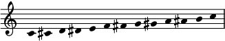
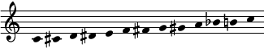
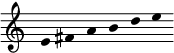

# The FJS Crash Course

So, you are intrigued by what the FJS has to offer, and would like to learn to use it.

This "crash course" was designed specifically with a focus on fast acquisition of all the fundamental elements of the system. It puts less focus on its shorthand system, which is not necessary. If you already have had exposure to Just Intonation, the FJS will be extremely easy for you to learn - you can learn it all in one sitting within a few minutes. Its beauty and simplicity are at your grasp.

## Introduction: Abandoning Enharmony

We are all familiar with standard staff notation and its conventional sharps and flats. But what we may not realize is that we learn staff notation as adapted for our omnipresent tuning system, twelve-tone equal temperament (from now on, this course will use the abbreviation 12-EDO, for Equal Divisions of the Octave).

For example, here is the 12-EDO chromatic scale:

No, wait. Actually, the way that it is most commonly written is like this:

Replacing that A♯ with B♭ makes no difference to us, of course. We know that those are different names for two notes that are of the same pitch. Choosing between these names is just a matter of legibility, or consistency, or simplicity, as given by context, but they are equivalent.

This property - that the interval of a diminished second be the same size as a perfect prime - has a name: enharmonic equivalence. In fact, musicians who are not familiar with (or aware of) alternate tuning systems may not even know that this property is not universal, and that 12-EDO is one of few tuning systems that satisfies it. In other tuning systems, there is no enharmonic equivalence or there is a different interval of the same size as the perfect prime. (For example, in 19-EDO, the perfect prime is the same size as the *double* diminished second, so E♯ and F♭ are actually equivalent.)

But let's not forget that staff notation predates even the thought of using 12-EDO (to say nothing of complete dominance) by many centuries. Staff notation was originally based on the diatonic scale, which - among its many simultaneous properties - also has the property of being generated from a stack of fifths (F-C-G-D-A-E-B). Actually, the very *fact* that staff notation has multiple ways to name the same pitch in 12-EDO implies that its original construction was based on something very different from 12-EDO.

In other words, enharmonic equivalence is the only 12-EDO feature in staff notation. Everything else is independent.

## Preliminary

Before you start learning about the FJS, there are three mathematical concepts that are FJS-specific that you must be acquainted with.

The first is the ability to quickly convert back and forth between an **interval in staff notation** (without enharmonic equivalence) and the **number of steps by fifths** which is required to build that interval. For example, a **major second** is **+2** fifths, because reaching the major second requires 2 steps by fifths in the clockwise direction: C-G-D. Similarly a **minor third** is **-3 fifths**, because reaching it requires 3 steps by fourths, which are fifths in the anticlockwise direction: C-F-B♭-E♭. Each interval in staff notation has one unique number of steps by fifths corresponding to it. You must be able to perform this conversion and the backwards conversion, ideally quickly.

The second is the ability to prime-factorize a rational number. Much like any **positive integer** can be uniquely factorized into primes with **natural number** exponents (this is the Fundamental Theorem of Arithmetic), any **positive rational number** can be uniquely factorized into primes with **integer** exponents. I will humorously dub this the Fundamental Theorem of Harmony. For example, the number 6/5 factorizes to 21 31 5-1 and no other factorization exists. (Given that this is a crash course, the mathematical details of this fact will be omitted, but of course [they are available](math.html) for the curious reader. From this point onwards, the symbol (\*) will indicate a reference to the mathematics page.)

The third is taking the reduced form of an interval. In practice, it consists of multiplying or dividing a number by 2 until the result is between 1 (inclusive) or 2 (exclusive); this process reflects our perception of *octave equivalence*, the tendency to perceive pitches off by an interval of 2/1 (the octave) as equivalent. For example, 7/1 becomes 7/4, and 1/6 becomes 4/3. The reduced form is given by the formula:

$$\text{red}(d)=d \cdot 2^{-\lfloor\log_2 d\rfloor}$$

Aside from that, you should also be familiar with cent measure for interval size. 100 cents is one 12-EDO semitone and 1200 cents is one octave. To calculate the cent size of an interval, use one of these formulae:

$$\displaystyle \text{C}(d)=\frac{1200 \cdot \log d}{\log 2} \text{ , where log is to an arbitrary base}$$

$$\text{C}(d)=\log_c d \text{ , where }c=\sqrt[1200]{2}$$

This is just about all you need, so let's get started!

## Lesson 1: Pythagorean Tuning

You might think that removing enharmonic equivalence from staff notation gives us access to a vastly larger number of pitches, and you would be correct. However, removing enharmonic equivalence, on its own, is insufficient to represent the entirety of JI in a meaningful way. One of the merits of JI is its ability to express very small differences in pitch to give different intervals different flavors.

Consider the sequence of JI intervals: 11/10, 10/9, 9/8, 8/7. Listen to it below:

<audio controls><source src="" type=""></audio>

All of them are "some type of major second" to most listeners, but it would be wrong to represent all of them with a major second in writing. They are very different intervals, and suppressing variety where it is the biggest virtue is contradicting the very essence of JI.

In that case, you might think that there might exist some middle ground, a subset of JI, which can be mapped exactly onto staff notation without enharmonic equivalence, and again you would be correct. That middle ground is none other than 3-limit JI, also known as Pythagorean tuning.

> **FJS Rule \#1: Conventional staff notation represents Pythagorean tuning.**

This means that the octave in staff notation is assigned the JI ratio 2/1, exactly the same as in 12-EDO, and that the perfect fifth in staff notation is assigned the JI ratio 3/2. With this assignment, every possible interval in staff notation is assigned exactly one possible 3-limit JI interval; there is a bijection. (\*)

I should note that this requires something that some musicians may not be aware exists: multiples, beyond double, of the sharp and flat. While extremely rarely used in conventional music, they are required here. In the FJS, sharps and flats can appear with any multiplicity. This is not to say that they are common; just do not panic when you have to use them.

You are now ready to learn the first two FJS techniques.

### FJS Technique \#1: To convert from a Pythagorean ratio to an FJS representation.

1. Factorize the ratio.
2. Initially ignore octaves (powers of two).
3. If the power of three is positive, move that many steps by fifths clockwise; if negative, move anticlockwise. Convert that number to an interval.
4. Adjust octaves as required.

### FJS Technique \#2: To convert from an FJS representation of a Pythagorean ratio back to the ratio.

1. Initially ignore octaves.
2. Convert the interval to the number of steps by fifths.
3. Raise three to that power and take the reduced form.
4. Adjust octaves as required.

Below is a table of some common ones:

| Interval | Steps | Ratio   |
|----------|-------|---------|
| m2       | -5    | 256/243 |
| M2       | +2    | 9/8     |
| m3       | -3    | 32/27   |
| M3       | +4    | 81/64   |
| P4       | -1    | 4/3     |
| P5       | +1    | 3/2     |
| m6       | -4    | 128/81  |
| M6       | +3    | 27/16   |
| m7       | -2    | 16/9    |
| M7       | +5    | 243/128 |

You don't need to memorize this table. Memorization is not at all necessary to use the FJS. Instead, as with mental arithmetic, it's useful for speeding up your fluency. You should ideally be able to work out all these ratios given the intervals, and vice versa, on your own, given the two techniques listed above. Don't be afraid to use calculators to help you; you'll find one very useful when working with the FJS until you become fluent and simply know the common results.

### Exercise

1. Find the FJS intervals corresponding to the following Pythagorean ratios: 2187/2048, 1024/729, 8192/6561.
2. Find the Pythagorean ratios corresponding to the following FJS representations: d7, A5, d3.
3. Find the Pythagorean ratios between consecutive steps in this scale:
	
4. Notate this scale in the FJS with D as tonic: 1/1, 81/64, 4/3, 3/2, 243/128, 2/1.
5. Find the ratio of the Pythagorean comma (d2 in the FJS).
6. (HARD!) One particularly small interval in Pythagorean tuning, only about 3.6 cents, has the ratio 353/284. Find its FJS representation.

Answers to all exercises are given at the end of this page.

## Lesson 2: The Prime Intervals

All right, you've learned to write all of Pythagorean tuning. This is pretty boring for now, since Pythagorean doesn't even deviate from 12-EDO that much - aside from having a nonzero diminished second. And more importantly, it's not even close to being able to notate the entirety of Just Intonation.

The next step in being able to cover all of JI is to cover the so-called prime intervals. These are intervals in the overtone series based on prime numbers. To find them, we take the prime numbers:

2, 3, 5, 7, 11, 13, 17, 19, ...

...and we take the reduced form of all of them:

1/1, 3/2, 5/4, 7/4, 11/8, 13/8, 17/16, 19/16, ...

We already know how to notate the first two primes: the octave and the fifth. Those are covered.

Now, if you are familiar with JI, then you might have heard of 5/4 being called a "just major third" and 7/4 being called a "harmonic seventh" - a form of "minor seventh". Chances are, this language may not have seemed strange to you at first place. These just seem like innocent extensions of the notion of "major third" and "minor seventh" to include intervals that are close to those interval classes.

But if we consider this on a formal level, things start to get weird.

Say we accept this at first: 5/4 is a type of major third. So we'll notate it as a major third, with some kind of additional symbol indicating the deviation. The difference from the Pythagorean major third, 81/64, is the small interval of 81/80, about 22 cents. This should be fine, why would it be problematic? The reason is because the Pythagorean diminished fourth, 8192/6561, is *much* closer. The difference between that and 5/4 is only 32805/32768, only about 2 cents!

Why should we choose the major third over the diminished fourth to notate 5/4? Ah, simplicity, I hear you say. The major third is only +4 fifths, while the diminished fourth is the much more complicated -8 fifths. But then in that case, why don't we use the *minor* third to notate 5/4 - clearly it is simpler, only -3 as opposed to +4 fifths. Oh, it's too far away now? Who are *you* to decide the exactly correct balance between simplicity and proximity?

OK, calm down, that was satire. Satire of other JI notation systems which hand-pick these approximations. In the FJS, the answer to the question "How do we choose the approximations for each prime interval?" is simple - we don't. A fixed constant, called the **radius of tolerance**, does this for us. After experimenting with many different possible radii of tolerance and considering the advantages and disadvantages of each, I have come to the conclusion that the standard version of the FJS will use the following radius:

$$\displaystyle \lambda =\sqrt{\frac{33}{31}}$$

The reason will be explained later.

What does the FJS do with this number? The next step is the most important element in the entirety of the FJS; it's the element that makes it so unique among other notation systems for JI. It is the **FJS master algorithm.** Here it is, in a human-readable form. Implementations in programming languages, including a calculator on this website, are available as well.

The **FJS master algorithm** outputs the so-called **generator function** for each prime number input with a radius of tolerance. I will explain below what the algorithm does, how it is used, and what the generator function is used for.

### The FJS Master Algorithm

1. Input the desired prime interval, of a prime greater than 3, in octave-reduced form.
2. Let k = 0.
3. Consider the interval of k fifths, in octave-reduced form.
4. Are the intervals closer than the radius of tolerance?
5. If so: k is the generator function. Output. End.
6. If not: move to the next k in the sequence: (0, 1, -1, 2, -2, 3, -3, ...) and repeat from step 3.

As you can see, the algorithm is simple enough that you can implement it in your mind yourself, except for step 4, which is difficult to realize with mental arithmetic until you know the cent sizes of many intervals by heart.