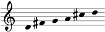
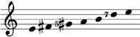
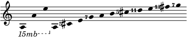
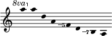
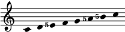

# Solutions for [the Crash Course](crash.md)

## Exercise 1

1. A1, d5, d4.
2. 32768/19683, 6561/4096, 65536/59049.
3. 9/8, 32/27, 9/8, 32/27, 9/8.
4.
	

## Exercise 2

1. -1, -4.
2. 513/512.
3. +1.
4.
	
5.
	
6.
	

## Exercise 3

1. M65, m35, m37, m75.
2. 10/9, 9/7, 11/6.
3. 
	
4. No. It would be the sixth mode if the fourth degree of the scale was F5 instead of F. The two scales are actually built on tonic, subdominant, and dominant triads of 4:5:6 (5/4 major) and 10:12:15 (6/5 minor) respectively. The scale with 3 major triads contains only 2 minor triads, and the scale with 3 minor triads contains only 2 major triads.