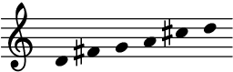
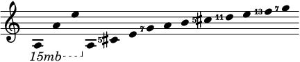
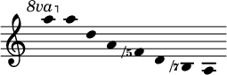
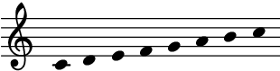
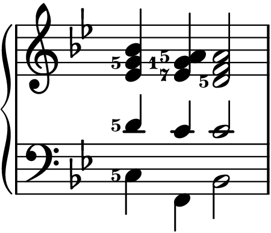
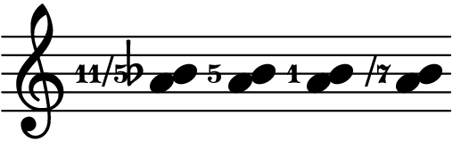

# Solutions for [the Crash Course](crash.md)

## Exercise 1

1. A1, d5, d4.
2. 32768/19683, 6561/4096, 65536/59049.
3. 9/8, 32/27, 9/8, 32/27, 9/8.
4.  <audio controls><source src="../assets/solutions/pentatonic.mp3" type="audio/mpeg"></audio>
5. 531441/524288. (Or its reciprocal; this is a bit tricky. 531441/524288 is the interval from C to the B♯ **below** it, which cannot be represented easily as an interval: augmented zeroth?! Anyway, by size, it's a diminished second.)
6. AAAAAAA3. It's a septuple augmented third, minus an octave. Yes. Above C, it would be written as a major third with seven sharps. Yikes.

## Exercise 2

1. −1, −4.
2. 513/512.
3. +1.
4.  <audio controls><source src="../assets/solutions/seven-limit.mp3" type="audio/mpeg"></audio>
5.  <audio controls><source src="../assets/solutions/overtone-long.mp3" type="audio/mpeg"></audio>
6.  <audio controls><source src="../assets/solutions/undertone.mp3" type="audio/mpeg"></audio>

## Exercise 3

1. M65, m35, m37, m75.
2. 10/9, 9/7, 11/6.
3.  <audio controls><source src="../assets/solutions/just-major.mp3" type="audio/mpeg"></audio>
4. No. It would be the sixth mode if the fourth degree of the scale was F5 instead of F. The two scales are actually built on tonic, subdominant, and dominant triads of 4:5:6 (5/4 major) and 10:12:15 (6/5 minor) respectively. The scale with 3 major triads contains only 2 minor triads, and the scale with 3 minor triads contains only 2 major triads.

## Exercise 4

1. m27, A2513, d41125.
2. 12/7, 13/10, 243/200.
3.  <audio controls><source src="../assets/solutions/ii-v-i.mp3" type="audio/mpeg"></audio>
4. The following five chords:
	- I chord: 1/1, 3/2, 5/4, 1/1
	- vi chord: 5/3, 5/3, 5/4, 1/1
	- ii chord: 4/3, 5/3, 4/3, 10/9
	- V chord: 3/2, 3/2, 9/8, 15/8
	- I chord: 1/1, 3/2, 5/4, 1/1
5. 
6. P155. The interval is 440/432 = 55/54. Please don't buy into 432 Hz stuff, thanks.
