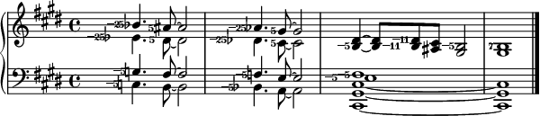

---
title: Le Système fonctionnel de l'intonation juste
---

> *L'avantage d'une langue bien construite est que sa notation simplifiée est souvent la source des théories profondes.*
>
> — Pierre-Simon Laplace

---

# Bienvenue

Bienvenue à la site Internet du Système fonctionnel de l'intonation juste (FJS)!

## Qu'est-ce que le FJS?

Le Système fonctionnel de l'intonation juste (en anglais: Functional Just System, **FJS**) est un nouveau système de notation pour la musique en **intonation juste** (en anglais: Just Intonation, **JI**). Il est basé sur une augmentation de la notation contemporaine de la portée pour pouvoir exprimer toutes les formes possibles de l'intonation juste. Il dépasse les autres systèmes de notation actuels en ce qui concerne la simplicité, l'ingéniosité et la beauté (y compris la notation Helmholtz-Ellis et la notation de Ben Johnston). Dans le domaine de la musique microtonale, le FJS est l'invention dont je suis le plus fier.

Le Système fonctionnel de l'intonation juste:

- permet de **traduire** les proportions pures de l'intonation juste dans la langue universelle de tous les musiciens: la notation de portée, et inversement;
- est **extrêmement facile** à apprendre à lire et à écrire; sa simplicité dépasse beaucoup celle des autres notations de l'intonation juste;
- prévoit une **bijection** entre la notation et le son, chaque ton n'a qu'une seule représentation, et peut donc être écrit et lu sans équivoque;
- peut représenter **toute l'infinité** de l'intonation juste, pas seulement jusqu'à un limite fixe, et exprime donc des tons que les autres notations de l'intonation juste **ne peuvent pas exprimer**;
- a une **précision infinie**, cela signifie que l'hauteur absolue est préservée;
- est gérée par un **algorithme** et générée de **manière procédurale**, alors adapté pour l'utilisation dans la musique assistée par ordinateur, et peut être complètement automatisé, sans apprendre des nombres par cœur ou les chercher. (Il y a plusieurs calculatrices sur ce site pour ces buts.)

## Qu'est-ce que l'intonation juste?

Si vous vous posez cette question, vous n'appartenez probablement pas ici!

La majorité de la musique contemporaine utilise le **tempérament égal de douze notes** (aussi appelée tout simplement "tempérament égal") qui divise l'octave en douze parties égales. **L'intonation juste** (**JI**) est une méthode d'intonation qui est très différent de ce courant dominant. Les principes de l'intonation juste proviennent des tons harmoniques et les qualités naturelles du son. Bien que JI ne soit plus utilisée dans la musique conventionnelle, elle reste importante pour la théorie de la musique, puisqu'elle était normale chez les cultures anciennes et le Moyen Âge et elle est encore utilisée chez les cultures non européennes ainsi que la musique d'avant-garde. (Sans parler de ses valeurs esthétiques!)

Il est prévu que vous ayez déjà une connaissance basique de l'intonation juste (et bien sûr un peu de théorie de la musique) pour pouvoir comprendre et effectivement utiliser le FJS. En général, **plus d'expérience** avec JI signifie **plus d'aisance** avec les FJS.

Pour une connaissance élémentaire de JI, je recommande [Just Intonation Explained](https://www.kylegann.com/tuning.html) écrit par Kyle Gann.

## Le FJS est-il assez simple?

Il n'y a que sept règles pour tout dont on a besoin pour écrire toute l'intonation juste dans le FJS. C'est vrai, seulement sept.

1. Toutes les notes avec des altérations conventionnelles représentent l'accord pythagoricien. Toutes les octaves signifient 2/1 et toutes les quintes justes signifient 3/2.

2. Tous les intervalles premiers au-delà de 3/2 (donc 5/4, 7/4, 11/8, etc.) reçoivent une approximation pythagoricienne selon l'algorithme principal du FJS. L'algorithme trouve l'approximation la plus simple dans les limites d'une constante appelée rayon de tolérance. La différence entre eux reçoit une altération associée avec ce nombre premier. Le symbole pour cette altération est le nombre premier lui-même.

3. Toutes les altérations du FJS sont positives quand l'approximation pythagoricienne d'un intervalle premier devient l'intervalle premier lui-même. Cela signifie que le positif n'est pas toujours ascendant et le négatif n'est pas toujours descendant; le positif est toujours otonal et le négatif est toujours utonal.

4. Les altérations du FJS peuvent être combinées. On multiplie les parties otonales, et multiplie les parties utonales. Par exemple: +25 signifie un double +5. L'otonal est l'utonal sont toujours séparés. Lorsque les nombres deviennent trop grands, on peut écrire aussi des facteurs séparés par des virgules.

5. Pour nommer les notes, on écrit premièrement la partie conventionnelle du nom, puis l'altération positive combinée comme indice supérieur, puis la négative comme indice inférieur.

6. Pour écrire les notes sur la portée, on écrit d'abord l'altération positive combinée (s'il y en a), puis l'altération négative combinée (s'il y en a) avec un signe moins, puis les altérations conventionnelles, puis la note.

7. Tout le reste sont des abréviations.

## Pourquoi le FJS?

Pourquoi en avons-nous besoin? Qu'est-ce qui m'a motivé à créer le FJS? Quels avantages y en a-t-il pour les musiciens? Pourquoi l'utiliser, et comment aide-t-il à composer et analyser la musique en intonation juste? Pourquoi même essayer de représenter l'intonation juste sur la portée? La notation de portée fut d'ailleurs créée pour la musique basée sur le cycle des quintes et la gamme diatonique. En revanche, l'intonation juste est un réseau de proportions qui sont connectés d'une façon belle mais étrangère. La musique en intonation juste fonctionne d'une manière très différente de celle que nous écrivons d'habitude. Un essai de la représenter comme ça serait certes anormal et maladroit.

Pourquoi est-ce que j'ai pourtant décidé de réaliser cette idée? Pour la raison que la notation de portée est une langue de communication entre musiciens. Bien qu'elle ne soit pas parfaite, elle est universelle pour tous les musiciens. En outre, nous sommes habitués à penser en notes. Ne serait-il pas utile de pouvoir traduire la langue de l'intonation juste qui est belle et régulière, mais peu intuitive, dans la langue de la portée qui est familière? Ne permettrait-il pas que les musiciens comprennent l'intonation juste avec plus d'intuition et étendent ses aspects à tous les processus liés à la musique conventionnelle: la composition, l'analyse et la performance?

**Bien sûr que oui.**

Le FJS, c'est beaucoup plus qu'un système de notation. Lorsque j'ai créé le système, il m'a permis de trouver un sens dans un chaos apparent de l'intonation juste. Il m'a démonstré que la notation de portée est beaucoup plus logique et plus liée à l'intonation juste que j'avais pensé. Pour toutes ces raisons, je vous invite aussi à connaître la facilité et la beauté du FJS et à comprendre comment ses roues dentées musicales connectent deux aspects qui semblent très éloignés.

Je comparerais le FJS à Lojban. Lojban est une langue artificielle créée pour découvrir comment la pensée des gens se changerait si leur langue était complètement logique et avait du sens. Je crois que le FJS serait un "Lojban de la musique microtonale". Comme Lojban motive des gens à penser de manière logique, le FJS motive des musiciens à penser en intonation juste. C'est pourquoi il permet de lier la composition, l'analyse et la performance de cette musique à leur connaissance de la théorie de la musique, qui est elle-même liée à celle de JI.

## Quoi maintenant?

- Vous trouvez ici un [cours intensif](crash.html) du FJS. Avec une connaissance médiocre de JI, il ne faut que quelques minutes pour apprendre le FJS.
- Lisez la [description formale complète](rules.html) si vous avez un doute en ce qui concerne les règles exactes.
- Voyez les [mathématiques](math.html) grâce à lesquelles le FJS a en fait une bijection ainsi que toutes les autres belles qualités dont j'ai parlé.
- Ici, je [compare](compare.html) le FJS à deux autres systèmes de notation en compétition: celui de Helmholtz-Ellis et celui de Ben Johnston, et j'explique pourquoi le FJS dépasse les deux.
- Utilisez les [calculatrices](calc.html) sur ce site pour faire des calculs FJS automatiquement. **Conseil:** Créez un signet sur elles tout de suite.
- Trouvez beaucoup plus d'[exemples](examples.html) du FJS en usage.

**Le FJS, que signifiera-t-il pour toi?**
