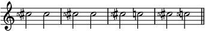
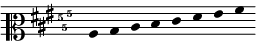
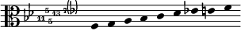
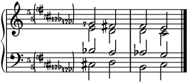
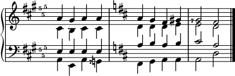
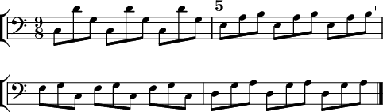

# La description formale complète

Ce site est *de facto* un manuel du FJS. Vous trouvez ici toutes les règles dont vous avez besoin pour utiliser le FJS, y compris le système des abréviations. Pourtant, la lecture de cette page ne vous sera pas utile si vous n'avez pas encore lu le [cours intensif](crash.html).

Tout ce qui concerne des abréviations expérimentales est marqué avec le symbole (\*).

## L'algorithme principal du FJS

> 1. Entrez le nombre premier en forme réduite.
> 2. Soit *k* = 0.
> 3. Considérez l'intervalle construit de *k* quintes pythagoriciennes, en forme réduite.
> 4. Est-ce que la différence entre cet intervalle et l'intervalle premier s'élève à moins que le rayon de tolérance?
> 5. Si oui, *k* égale la fonction génératrice. Fin.
> 6. Si non, avancez au *k* suivant dans la séquence: (0, 1, −1, 2, −2, 3, −3, ...), et retournez à l'étape 3.

## Le comma formel

> Le comma formel d'un nombre premier *p* dont la fonction génératrice est *g* égale:
>
> $$\text{comma} (p)=\frac{\text{red} (p)}{\text{red} (3^g)}$$

## La conversion de chaque rapport JI en sa forme FJS

> 1. Factorisez le rapport.
> 2. Pour chaque nombre premier *p* au-delà de 3, avec un exposant α*p*, enregistrez α*p* pour chaque *p* et multipliez le rapport par
>
> 	$$(\text{comma} (p))^{-\alpha _p}$$
>
>	où $$\text{comma}(p)$$ est le comma formel de *p*.
>
> 3. Le résultat sera toujours pythagoricien. Convertissez-le en forme FJS.
> 4. Ajoutez maintenant les α*p* comme altérations: positif-otonal, négatif-utonal.
> 5. Réduisez et ajustez l'octave.

## La conversion de chaque forme FJS en le rapport JI qui convient

> 1. Convertissez la partie pythagoricienne (conventionnelle) de l'intervalle en rapport pythagoricien.
> 2. Pour chaque altération otonale de *p*, multipliez par le comma formel de *p*. Pour les utonales, divisez.
> 3. Réduisez et ajustez l'octave.

## Arithmétique des intervalles FJS

> - La somme de deux intervalles FJS de deux rapports égale l'intervalle FJS du produit de ces rapports.
> - La différence de deux intervalles FJS de deux rapports égale l'intervalle FJS du quotient de ces rapports.
> - Le renversement d'un intervalle FJS d'un rapport égale l'intervalle FJS de l'inverse du rapport.
> - Pour additionner deux intervalles FJS, additionnez d'abord les parties pythagoriciennes (conventionnelles), puis composez les altérations FJS.
> - Pour soustraire deux intervalles FJS, soustrayez les parties pythagoriciennes, puis échangez l'otonal avec l'utonal pour le second intervalle, puis composez les altérations. Soustraire un intervalle signifie le même qu'additionner son renversement.
> - Pour renverser un intervalle FJS, renversez la partie pythagoricienne, puis échangez l'otonal avec l'utonal.
> - Vous pouvez aussi additionner un intervalle à une note ou soustraire deux notes.

## Règles pour construire les noms de notes

1. Pour la notation conventionnelle, le FJS utilise l'accord pythagoricien. Donc Do-Mi est 81/64, Do-Ré♭ est 256/243, Ré♭-Do♯ est 531441/524288, etc.

2. Un seul comma du nombre premier *p* (au-delà de 3) utilisera le nombre *p* (de préférence: en indice supérieur) pour indiquer une déviation de ce comma **dans la direction originale**. Exemple: Mi5 est **plus bas** que Mi par 81/80 (puisque le comma de 5 égale 80/81); Fa11 est **plus haut** que Fa par 33/32 (puisque le comma de 11 égale 33/32). On prononce ces noms en ajoutant le nombre au nom conventionnel: « Mi-cinq », « Fa-onze ». Il est permis aussi de les séparer avec un préfixe « super » pour accentuer la séparation. La direction originale reste inchangée.

3. Un seul comma du nombre premier *p* utilisera le nombre *p* en indice inférieur pour indiquer une déviation de ce comma **dans l'inverse de la direction originale**. Exemple: Mi♭5 est plus haut que Mi♭ par 81/80; La19 est plus bas que La par 513/512. On prononce ces noms en ajoutant le préfixe « sub », donc: « Mi-bémol-sub-cinq », « La-sub-dix-neuf ».

4. Pour représenter des déviations composées **dans la même orientation** (toutes otonales ou toutes utonales), **multipliez** les nombres des commas (ne les additionnez ou enchaînez pas), parce que ces nombres sont tous premiers, et seulement la multiplication de nombres premiers peut être décomposée d'une seule façon, ce qui est dû au théorème fondamental de l'arithmétique. Nous pouvons alors toujours savoir les nombres premiers qui étaient multipliés (l'ordre ne fait aucune différence). Exemple: Sol♯25 est plus bas que Sol♯ par deux 81/80 et il n'y a que cette interprétation parce que 25 = 5 × 5 et il n'y a que cette factorisation.

5. Le produit peut généralement être factorisé mentalement. Les produits les plus fréquents sont tous bien connus: 25, 35, 49, 125, 625, 343, 55, 77, 65, 121. Dans le cas où il n'est pas du tout claire (par exemple 119 = 7 × 17), on peut utiliser une notation alternative où tous les facteurs sont écrits en séquence, avec des virgules entre eux. L'exemple ci-dessus peut alors être écrit comme Sol♯5,5, les deux notations sont correctes. Si on écrit des commas en séquence, il est d'habitude de les écrire dans un ordre non décroissant. Donc Ré119 serait Ré7,17 plutôt que Ré17,7. Les deux extrêmes peuvent aussi être combinées comme vous voulez, en multipliant certains facteurs, mais pas tous; donc Sol11,125 est identique à Sol1375. La prononciation n'est pas changée: « Sol-onze-cent-vingt-cinq ».

6. Des produits de commas positifs et négatifs sont indépendants. Dans le cas où il y a les deux, on écrit en même temps un indice supérieur et inférieur. Exemple: Fa75 signifie un Fa baissé de 64/63 et élevé de 81/80 (ou à l'inverse: élevé de 81/80 et puis baissé de 64/63, sans différence). Les produits des commas positifs et négatifs sont toujours premiers entre eux: sinon, il y a des facteurs qui peuvent être annulés; \*Do355 est identique à Do7.

7. Le nombre 1 signifie l'annulation de toutes altérations microtonales, ainsi que le signe bécarre dans la notation conventionnelle. On peut l'écrire soit en indice supérieur, soit en inférieur. Exemple: La séquence Do – Ré – Mi5 – Mi1 (ainsi que tout simplement Do – Ré – Mi5 – Mi) indique 1/1, 9/8, 5/4, 81/64 sur Do.

8. Les intervalles peuvent avoir ces altérations FJS ainsi que les notes.

## Règles pour utiliser les noms de notes dans la notation

1. Pour ajouter des commas positifs à une note, écrivez le nombre de l'altération composée devant la note. Pour la cohérence: On les écrit devant la note, pas derrière elle, comme des altérations conventionnelles. S'il y a une altération conventionnelle aussi, on écrit la microtonale encore devant la conventionnelle.

2. Pour ajouter des commas négatifs à une note, écrivez le nombre de l'altération composée devant la note, avec un signe moins (exemple: −35).

3. S'il y a en même temps des commas positifs et négatifs, on écrit premièrement le positif, puis un signe moins, puis le négatif.

4. *Les altérations pythagoriciennes divisent les notes du même ton diatonique (Do, Ré, Mi, Fa, Sol, La, Si) en leurs tons pythagoriciens. C'est pourquoi une altération pythagoricienne compte pour toutes les notes du même ton diatonique dans la même octave dans la même mesure (sauf si annulées ou écrasées).* Par analogie, les altérations microtonales fonctionnent de la même façon: elles divisent les notes du même ton pythagoricien en leurs hauteurs absolues. C'est pourquoi elles, elles comptent pour toutes les notes du même ton pythagoricien dans la même octave dans la même mesure (sauf si annulées ou écrasées). Donc si le premier Mi dans une mesure reçoit un +5, tous les Mi suivants dans la même octave le reçoivent aussi (avant qu'un +1 ne l'annule), mais ni un Ré, ni un Fa, ni un Mi♭ ne le reçoit pas, même dans la même mesure.

5. L'altération 1 signifie l'annulation de toutes les altérations microtonales pour le ton pythagoricien où elle est utilisée.

## Règles pour utiliser des armures FJS (\*)

1. Des armures FJS fonctionnent de la même manière que des pythagoriciennes, sont indépendantes des pythagoriciennes, et sont écrites après les pythagoriciennes si les deux existent en même temps.

2. Des armures FJS peuvent normalement ajouter des altérations microtonales seulement là où les tons sont déjà diatoniques dans une tonalité. Exemple: une pièce en La majeur qui a l'armure ♯Fa-Do-Sol peut normalement recevoir des altérations d'armure seulement pour les notes La, Si, Do♯, Ré, Mi, Fa♯, et Sol♯. Puisque ces armures sont déjà irrégulières, il n'y a pas d'ordre obligatoire. Pourtant, grâce à la nature pythagoricienne du FJS, elles vont souvent arriver dans des fragments des ordres conventionnels (Fa-Do-Sol-Ré-La-Mi-Si ou l'ordre inverse).

3. Des armures FJS peuvent aussi ajouter des altérations microtonales aux notes non diatoniques: on les écrit sur le ton diatonique correct, puis on ajoute une altération pythagoricienne en parenthèses. Les parenthèses sont indispensables pour qu'on sache que l'altération pythagoricienne ne compte pas elle-même. L'interprétation correcte: si l'altération pythagoricienne est utilisée dans la partition, l'altération microtonale aussi. Donc l'armure pour Do majeur - gamme majeure harmonique - serait: Si5 Mi5 La5 La5(♭). Cela signifie que tous les Si, Mi, et La reçoivent un +5 et tous les La♭ reçoivent un -5. Cela ne signifie pas que tous les La reçoivent un bémol, mais que seulement les La bémol reçoivent un -5.

4. Comme chez les altérations conventionnelles, des altérations accidentelles FJS ne se mélangent pas avec celles des armures FJS. Des altérations accidentelles écrasent toujours celles des armures. Un Mi avec une altération accidentelle −7 est toujours Mi7, même si l'armure dit Mi5. (L'interprétation correcte n'est pas du tout Mi57.)

5. Un changement d'armure pythagoricienne ne signifie pas que l'armure FJS change aussi. Une pièce qui commence avec des armures ♯Fa-Do-Sol et Fa5 Do5 Sol5 ne perdra pas son armure FJS quand la pièce module à La bémol majeur (♭Si-Mi-La-Ré). Puisqu'il n'y a pas de changement d'armure FJS, dans ce La bémol majeur, chaque Fa dièse recevrait un +5. Cela semble un peu bizarre parce qu'on ne veut jamais un Fa dièse en La bémol majeur. Mais de l'autre côté, cette règle a pourtant du sens parce qu'elle permet d'éviter la répétition de l'armure FJS quand la modulation est simple (par exemple, de ♯Fa-Do-Sol à ♯Fa-Do). Il est probable qu'on voudrait que les Fa dièse et Do dièse (et Sol dièse, qui lui aussi peut arriver en Ré majeur) restent +5.

6. Un changement d'armure FJS annulera toutes les altérations de l'armure précédente. Si la pythagoricienne a changé en même temps (ce qui se passe toujours avant le changement FJS), les altérations FJS dans la nouvelle armure sont bien sûr définies par rapport aux nouveaux tons diatoniques. Exemple: ♯Fa-Do-Sol Fa5 Do5 Sol5 est l'échelle ptolémaïque en La majeur. Un changement d'armure pythagoricienne à ♭Si-Mi-La-Ré causerait ♭Si-Mi-La-Ré Fa5(♯) Do5(♯) Sol5(♯). Mais la répétition simple de l'armure FJS (écrite comme Fa5 Do5 Sol5) après le changement pythagoricien a un effet différent: la combinaison ♭Si-Mi-La-Ré Fa5 Do5 Sol5 s'appliquent aux Fa, Do, et Sol qui sont diatoniques en La bémol majeur, donc Fa♮, Do♮ et Sol♮, pas Fa♯, Do♯ et Sol♯.

7. Un changement d'armure FJS est indiqué avec au moins une altération microtonale. Si vous voulez en annuler tous, vous pouvez l'indiquer avec une série de signes +1 (ce qui est l'équivalent des signes bécarre dans le FJS). Cette annulation arrive automatiquement avec chaque changement d'armure FJS. Remarquez qu'une annulation de toutes altérations FJS est très rarement exigé.

8. Il est permis d'omettre une armure FJS dans des systèmes après le premier. Ceci est dû tout simplement au fait qu'ils sont peut-être difficiles à écrire dans certains logiciels.

## Règles pour utiliser les lignes de transposition FJS (\*)

1. Les lignes de transposition FJS fonctionnent de manière similaire aux lignes d'octave conventionnelles, mais elles appliquent une altération FJS au lieu d'une octave.

2. Il n'y a aucune différence entre les lignes de transposition *alta* ou *bassa* pour le FJS.

3. Une ligne de transposition FJS commence avec une altération composée FJS, de la même manière que si elle était sur la portée. +5 devient donc « 5 » et +7−5 devient « 7−5 », etc. Il n'est pas obligatoire d'écrire « loco » lorsqu'elle termine.

4. Toutes les notes sous une ligne de transposition FJS **additionnent** l'altération de cette ligne aux valeurs normales dues aux altérations accidentelles et celles d'armure.

## Plus d'éléments expérimentaux (\*)

À partir d'ici, le FJS est open-source! Créez vos propres éléments d'abréviation si vous croyez qu'ils sont utiles. Vous pouvez même créer des dialectes FJS avec des rayons de tolérance alternatifs (la calculatrice a cette option), des commas pour chaque limite des nombres impairs, pas seulement des nombres premiers, ou même avec des altérations toujours positif-hausse, négatif-baisse.

Je ne suis pas un créateur têtu qui ne permettra pas que quelqu'un modifie son œuvre si les modifications sont bonnes. Dans le passé, le FJS avait beaucoup d'éléments très mauvais, dont certains ont été modifiés ou éliminés au dernier moment. Si vous croyez que vous avez inventé un nouveau élément utile, partagez-le avec moi par e-mail et je l'ajouterai ici avec plaisir.

## Exemples

Ici on voit Sol♭75 et Fa♯57.

Ici: Do♯5 Do♯5; Do♯5 Do♯; Do♯5 Do; Do♯5 Do5.

L'échelle suivante est celle de La majeur; La, Si, Do♯5, Ré, Mi, Fa♯5, Sol♯5, La.

L'échelle suivante est la partie 8-16 de l'échelle harmonique sur Fa; Fa, Sol, La5, Si♭11, Do, Ré♭13, Mi♭7, Mi5, Fa. (L'armure n'est pas pratique, mais possible.)

La progression suivante contient deux accords de septième diminuée 10:12:14:17 et deux triades majeures 4:5:6, sur La, Ré, Sol, Do, dans cet ordre.

La progression suivante démontre l'utilité de la règle qu'un changement d'armure pythagoricien ne signifie pas toujours celui du FJS. Ici on voit: La majeur, Mi majeur, La majeur, La septième de dominante, Ré majeur, Sol majeur, Ré majeur deuxième renversement, Mi majeur avec La, La septième de dominante, Ré majeur. Ici, les triades majeures sont toutes 4:5:6 et les accords de septième de dominante sont tous 4:5:6:7. L'armure FJS ne disparait pas après la modulation, ce qui est utile parce qu'il faudrait qu'un Sol dièse en Ré majeur soit +5.

Cet exemple-ci utilise les huit notes Do, Ré, Mi5, Fa, Sol, La5, La, et Si5 sans aucune armure.

