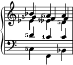
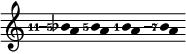

# Solutions pour [le cours intensif](crash.md)

## Aufgabe 1

1. Prime augmentée, quinte diminuée, quarte diminuée.
2. 32768/19683, 6561/4096, 65536/59049.
3. 9/8, 32/27, 9/8, 32/27, 9/8.
4. 
5. 531441/524288. (Ou bien l'inverse, c'est un peu bizarre. 531441/524288, c'est l'intervalle de Do au Si dièse **en bas**, ce qui ne peut pas être représenté par un intervalle: zérote augmentée?! C'est la même taille qu'une seconde diminuée.)
6. Une tierce augmentée sept fois (moins une octave). Oui. Sur Do, ce serait une tierce majeure avec sept dièses. Beurk.

## Aufgabe 2

1. −1, −4.
2. 513/512.
3. +1.
4. 
5. 
6. 

## Aufgabe 3

1. (Sixte majeure)5, (tierce mineure)5, (tierce mineure)7, (septième mineure)5.
2. 10/9, 9/7, 11/6.
3. 
4. Non. Ce serait le sixième mode si on avait Fa5 au lieu de Fa. Ces deux échelles sont construites avec des triades sur la tonique, la sous-dominante et la dominante, soit avec 4:5:6 (tierce majeure 5/4), soit avec 10:12:15 (tierce mineure 6/5). L'échelle qui a trois triades majeures en a seulement deux mineures, et inversement.

## Exercise 4

1. (Seconde mineure)7, (seconde augmentée)513, (quarte diminuée)1125.
2. 12/7, 13/10, 243/200.
3. 
4. Les cinq accords suivants:
	- 1/1, 3/2, 5/4, 1/1
	- 5/3, 5/3, 5/4, 1/1
	- 4/3, 5/3, 4/3, 10/9
	- 3/2, 3/2, 9/8, 15/8
	- 1/1, 3/2, 5/4, 1/1
5. 
6. (Unisson)55. L'intervalle est 440/432 = 55/54. Ne croyez pas en ces balivernes 432 Hz, merci.
