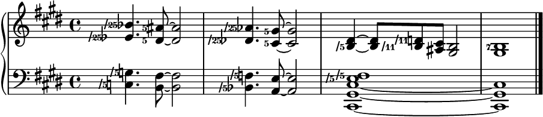

---
title: la fancu ke curve ciste
---

> *.i prali fi lo ka pilno lo se gerna poi xamgu se zbasu kei fa lo du'u lo frili snici'e pe gy cu rinka tu'a so'i smucfu ente'ori*
>
> — sei la pi'er simon laplas cu cusku

---

# fi'i

ni'o ui friti tu'a ti noi kibystu pe la fancu ke curve ciste ku goi fy jy sy

## fy jy sy mo

[ni'o e'e kinzga lo panra](https://youtu.be/38I3cylJlW4)

ni'o la **fancu ke curve ciste** ku noi zoi gy **Functional Just System** gy e lu **fy jy sy** li'u glico cmene cu cnino ciste te pi'o tu'a lo **cuvyto'aci'e** zgike
.i cumki fa lo nu pilno lo zgisnici'e poi panra lo fadni ciste ku'o lo ka sepli skicu ro cuvyto'aci'e
.i te zu'e bo zmadu lo'e drata ciste ne mu'u zo'e pe la xelmxolts elis ge'u e zo'e pe la ben djonston lo ka melbi je finkai je frili
.i fy jy sy traji lo ka mi jgira kei fo lo'i se ke snada co finti ke'e be mi be'o poi srana lo cmato'aku'e zgike

ni'o la fancu ke curve ciste ku zo'u tu'e

- .i jai tadji lo nu **fanva** fi lo parbi pe lo cuvyto'aci'e lo zgike bangu poi jai se jimpe ro zgipre ku'o no'u lo zgisnici'e ge'u soi vo'i vo'o
- .i lo ka cilre lo nu tcidu je ciska do'e cu **tcetce frili** .i je fy jy sy mutce zmadu lo cuvyto'aci'e snici'e poi drata vau lo ka sampu
- .i nibli lo nu ro sinxa e ro sance cu **pavysmu** .i je ro tonga cu se sinxa pa da
- .i jai tadji lo nu ciska lu'e **lo cuvyto'aci'e be li ci'i** e nai lo jai se xusra .i ja'e bo **zmadu** lo drata lo ka skicu se pi'o ce'u xo kau tonga
- .i **cimni** lo ka lo ce'u sinxa cu satci .i ja'e bo ro tonga cu se sinxa lo traji
- .i jicmu fa lo **algoritma** be ve pu'e ro da .i ja'e bo mapti lo nu skami zgifi'i .i je ka'e zmiku se cau lo nu morji cilre ja zvafa'i lo datni .i to ti noi urli cu sitna so'o tutci be lo nu kanji dy toi

tu'u

## lo cuvyto'aci'e cu mo

ni'o do kucli di'u .i jo o'i do ca tcidu lo tolmapti la'a

ni'o so'e zgike poi cabna cu se jicmu lo togyci'e poi se cmene lu **dunto'aci'e li pa re** li'u e sa'u zo **dunto'aci'e**
.i dy jai nu dunli fendi lo togyku'e be li re lo pa re da
.i lo **cuvyto'aci'e** goi **cy ty** cu mutce frica lo bi'u nai fadni togyci'e
.i lo tonga jicmu be cy ty cu jai se jdice fai tu'a lo rarna jinzi be lo sance
.i cy ty na so'i roi jai se pilno lo fadni zgike
.i to'e ki'u nai bo vajni lo zgike ente'ori
.i ki'u bo cy ty fadni fi ge lo kulnu poi purci ku'o gi lo te ritli be fi lo nu zgipli kei gi'e di'i ve finti lo zgike poi nalfadni
.i to li'a na ra'asku fu lo du'u melbi toi

ni'o sarcu fa lo nu djuno je jimpe fi cy ty e so'u lo zgike ente'ori fe so'o da kei lo nu certu binxo tu'a fy jy sy
.i su'a do zenba lo ka jimpe fi lo sidbo be cy ty kei na a lo ka sutra jijnu fi fy jy sy

ni'o lo ka frili ke binxo co slabu cy ty zo'u tu'e

- .i lo [cuvyto'aci'e](https://en.wikipedia.org/wiki/Just_intonation) cu se karni la uitki
- .i la'o gy [Just Intonation Explained](https://www.kylegann.com/tuning.html) gy fi'e la kail gan
- .i la'o gy [The Just Intonation Primer](http://www.dbdoty.com/Words/Primer1.html) gy fi'e la david b dotys

tu'u

## ma ni fy jy sy frili

ni'o ro da poi cuvyto'aci'e zgiselfi'i zo'u la'e do'e lu'u noi javni ze moi cu banzu lo nu snici'a da do'e fy jy sy
.i ja'a ze po'o mei
.i tu'e

1. .i ro lo zgika'usni joi lo togystika poi fadni cu se skicu fo tu'a lo cistrpitagora .i me'o py bi fa'u me'o py mu cu sinxa lo togyku'e pe li re fi'u fa'u li ci fi'u re

2. .i lo ro togyku'e poi frinu fe ja fi su'o dilcysle poi zmadu li ci ku'o ne mu'u li mu ce li ze cu se ke steci fancu fi lo jibni poi se cistrpitagora kei la fy jy sy ralju algoritma .i a bu kanji tu'a lo sampu je simsa be lo dilcysle banzu .i lo ve vimcu be ri bei lo dilcysle cu ckini lo pa togystika pe dy .i lu'e dy sinxa lo togystika

3. .i lo fy jy sy togystika cu jmina .i jo galfi lo jibni poi se cistrpitagora ku'o lo togyku'e pe lo dilcysle .i lo nu jmina fa'u vimcu na srana lo nu zenba fa'u jdika lo ni gapru .i ja'a go'i lo su'u galto'a fa'u dzito'a

4. .i lo togystika poi pluja cu se sinxa lo pilji be lo galto'a be'o jo'u lo pilji be lo dzito'a .i mu'a li ma'u mu cu se kurtenfa li ma'u re mu .i lo galto'a jo'u lo dzito'a ka'e nai mixre .i cumki fa lo nu cusku lu'e lo dilcysle jo'u lo lerkoma fau lo nu lo pilji cu barda dukse

5. .i lo cmene be lo zgika'u zo'u lo togystika cu jmina fa'u vimcu gi'o se ke li'erla'i tcita la'e zo ma'u fa'u zo ni'u

6. .i lo zgisnici'e zo'u cusku lu'e lo togystika poi zenba lu'u ce'o lu'e lo togystika poi jdika lu'u se ce'o bo lu'e me'o vi'i bu lu'u ce'o lu'e lo fadni togystika lu'u ce'o lu'e lo zgika'u

7. .i lo ro drata cu jai nu ciska sutra

tu'u

## xu zvati fa la cafrai preti

[ni'o ja'a go'i](faq.html)

## ca zukte ma

ni'o tu'e

- .i zvati ti fa [la janli xe ctuca](crash.html) ku pe fy jy sy .i fau lo ji'a nu so'o va'e jimpe fi cy ty cu sarcu lo nu cilre lo jicmu be lo fy jy sy sidbo kei fa tu'a lo mentu be li so'o po'o
- .i zgana [lo torveki](summary.html) be fy jy sy
- .i tcidu [lo se javni](rules.html) fau lo nu fa'idji fi lo se senpi
- .i mencti [lo xe karbi](compare.html) be fy jy sy bei lo re jivna snici'e no'u zo'e pe la xelmxolts elis ge'u e zo'e pe la ben djonston .i ba'o la'e di'u jimpe lo du'u fy jy sy zmadu re zo'e ma kau
- .i pilno [lo kajytci seljmaji](calc.html) .i **e'e** ca zi kibytci tcitygau fi ri
- .i lanli [lo so'i mupli](examples.html) be lo ka fy jy sy se pilno fi ce'u

tu'u

**ni'o fy jy sy ba mo do**

<audio controls><source src="../assets/index/impression.mp3" type="audio/mpeg"></audio>
