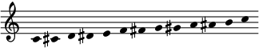
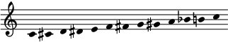
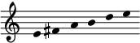
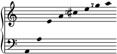
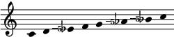
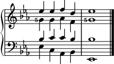

# Intensywny kurs FJS-u

Intryguje cię, co FJS ma do zaoferowania, i chciałbyś nauczyć się go używać.

Ten kurs stworzyłem z myślą o przyswajalności istoty systemu. Nie skupię się na pewnych udogodnieniach i skrótach, ponieważ nie są one konieczne ani niezbędne. Jeżeli już miałeś kontakt z naturalnymi temperacjami, FJS będzie dla Ciebie igraszką – nauczysz się go naraz, w kilka minut, a jego piękno i prostota będą Tobie w zasięgu ręki.

## Spis treści

* [Wprowadzenie: Koniec z enharmonią](#introduction)
* [Lekcja 0: Wiadomości wstępne](#lesson_0) 
* [Lesson 1: Pythagorean Tuning](#lesson_1)
* [Lesson 2: The Prime Intervals](#lesson_2)
* [Lesson 3: Compound Accidentals](#lesson_3)
* [Da Capo Al Fine: What Else?](#da_capo_al_fine)

---

## <a name="introduction">Wprowadzenie: Koniec z enharmonią</a>

Wszyscy jesteśmy zaznajomieni z zapisem nutowym i występującymi w nim znakami chromatycznymi. Możesz jednak nie być świadomy, że notacji tej uczymy się w wersji przystosowanej do wszechobecnej dwunastostopniowej temperacji równomiernej, w której na co dzień myślimy. (Od teraz będziemy nazywać ją skrótem 12-EDO, z angielskiego „12 equal divisions of the octave”, czyli „równomierny podział oktawy na dwanaście”).

Oto na przykład skala dodekafoniczna w 12-EDO:

Chwileczkę. Właściwie zwykle zapisujemy ją tak:

Oczywiście zamiana ais na b w tym miejscu nie robi nam różnicy. Wiemy, że to są dwie różne nazwy na tę samą wysokość. To, którą wybierzemy, zależy od naszych potrzeb – od czytelności, konsekwencji czy prostoty – i zależnie od kontekstu, ale są one sobie mimo wszystko synonimami.

Tę własność – przyrównanie zmniejszonej sekundy do prymy zwiększonej – nadano nazwę równoważności enharmonicznej. Co więcej muzycy, którzy nie zetknęli się z niekonwencyjnymi strojami albo nie są ich świadomi, mogą nie pojmować, że własność ta nie jest tautologią – wręcz przeciwnie, 12-EDO to jeden z *niewielu* strojów, które ją posiadają. (Dla kontrastu, 19-EDO-owa pryma czysta jest równa sekundzie *podwójnie* zmniejszonej, czyniąc eis i fes tymi samymi wysokościami).

Mimo tego nie zapominajmy, że historia zapisu nutowego sięga dalej niż sam pomysł 12-EDO – o jednomyślnym przyjęciu nie wspominając – poprzedzając go o kilka wieków. Notacja neumatyczna opierała się na skali diatonicznej, którą tworzono przez serię kwint (f–c–g–d–a–e–h). Właściwie sam fakt, że w zapisie nutowym istnieje więcej niż jeden sposób nazwania tej samej wysokości 12-EDO, sugeruje, że jego pochodzenie opiera się na czymś zupełnie odmiennym od 12-EDO.

Innymi słowy równoważność enharmoniczna to jedyna 12-EDO-owa własność, która daje o sobie znać w zapisie nutowym – cała reszta jest niezależna.

## <a name="lesson_0">Lekcja 0: Wiadomości wstępne</a>

Oto krótka lista wiadomości, które musisz rozumieć, żebyś mógł zrozumieć i FJS:

- Wiesz, że stroje naturalne to takie, w których każdy interwał jest wymierny.
- Rozpoznajesz pewne proste JI-owe ułamki, takie jak 2/1, 3/2, 5/4, czy 7/4.
- Dodajesz interwały przez mnożenie ich wartości, odejmujesz przez dzielenie, a odwracasz, biorąc odwrotność multyplikatywną (*x* → 1/*x*).
- Potrafisz wyliczyć wielkość danego interwału w centach; wiesz, że 100¢ to półton 12-EDO, a 1200¢ to oktawa czysta; umiesz, by to zrobić, posłużyć się jednym z tych wzorów:
	
	$$\displaystyle \text{C}(d)=\frac{1200 \cdot \log d}{\log 2} \text{ , dla dowolnej wspólnej podstawy log}$$
	
	$$\text{C}(d)=\log_c d \text{ , }c=\sqrt[1200]{2}$$
	
Do tego będziesz potrzebował jeszcze trzech matematycznych umiejętności konkretnych dla FJS-u.

The first is the ability to quickly convert back and forth between an **interval in staff notation** (without enharmonic equivalence) and the **number of steps by fifths** which is required to build that interval. For example, a **major second** is **+2** fifths, because reaching the major second requires 2 steps by fifths in the clockwise direction: C–G–D. Similarly a **minor third** is **−3 fifths**, because reaching it requires 3 steps by fourths, which are fifths in the anticlockwise direction: C–F–B♭–E♭. Each interval in staff notation has one unique number of steps by fifths corresponding to it. You must be able to perform this conversion and the backwards conversion, ideally quickly.

The second is the ability to prime-factorize a rational number. Much like any **positive integer** can be uniquely factorized into primes with **natural number** exponents (this is the Fundamental Theorem of Arithmetic), any **positive rational number** can be uniquely factorized into primes with **integer** exponents. I will humorously dub this the Fundamental Theorem of Harmony. For example, the number 6/5 factorizes to 21 31 5−1 and no other factorization exists. (Given that this is a crash course, the mathematical details of this fact will be omitted, but of course [they are available](math.html) for the curious reader. Anywhere in this course where a mathematical fact is taken for granted, look for a proof in the mathematics page.)

The third is taking the reduced form of an interval. In practice, it consists of multiplying or dividing a number by 2 until the result is between 1 (inclusive) or 2 (exclusive); this process reflects our perception of *octave equivalence*, the tendency to perceive pitches off by an interval of 2/1 (the octave) as equivalent. For example, 7/1 becomes 7/4, and 1/6 becomes 4/3. The reduced form is given by the formula:

$$\text{red}(d)=d \cdot 2^{-\lfloor\log_2 d\rfloor}$$

This is just about all you need, so let's get started!

## <a name="lesson_1">Lesson 1: Pythagorean Tuning</a>

You might think that removing enharmonic equivalence from staff notation gives us access to a vastly larger number of pitches, and you would be correct. However, removing enharmonic equivalence, on its own, is insufficient to represent the entirety of JI in a meaningful way. One of the merits of JI is its ability to express very small differences in pitch to give different intervals different flavors.

Consider the sequence of JI intervals: 11/10, 10/9, 9/8, 8/7. Listen to it below:

<audio controls><source src="../assets/audio_1.mp3" type="audio/mpeg"></audio>

All of them are "some type of major second" to most listeners, but it would be wrong to represent all of them with a major second in writing. They are very different intervals, and suppressing variety where it is the biggest virtue is contradicting the very essence of JI.

In that case, you might think that there might exist some middle ground, a subset of JI, which can be mapped exactly onto staff notation without enharmonic equivalence, and again you would be correct. That middle ground is none other than 3-limit JI, also known as Pythagorean tuning.

This means that the octave in staff notation is assigned the JI ratio 2/1, exactly the same as in 12-EDO, and that the perfect fifth in staff notation is assigned the JI ratio 3/2. With this assignment, every possible interval in staff notation is assigned exactly one possible 3-limit JI interval; there is a bijection.

This, actually, is how the set of diatonic pitch classes can be considered to be *defined*: F, C, G, D, A, E, and B are all defined such that F–C is 3/2, C–G is 3/2, etc. We notice that B–F can then be calculated to be 1024/729, which is close to 3/2 but is smaller. So we then define the sharp and flat to counter this difference, so that B–F♯ is 3/2 and B♭–F is 3/2. You will later see that the FJS works by extending this principle of countering differences with accidentals.

I should note that this requires something that some musicians may not be aware exists: multiples, beyond double, of the sharp and flat. While extremely rarely used in conventional music, they are required here so that the line of fifths is unbounded in either side. In the FJS, sharps and flats can appear with any multiplicity. This is not to say that they are common; just do not panic when you have to use them.

You are now ready to learn the first two FJS techniques.

> ### FJS Technique \#1: To convert from a Pythagorean ratio to an FJS representation.
> 
> 1. Factorize the ratio.
> 2. Initially ignore octaves (powers of two).
> 3. If the power of three is positive, move that many steps by fifths clockwise; if negative, move anticlockwise. Convert that number to an interval.
> 4. Adjust octaves as required.
>
> **Example:** To convert 9/8 to the FJS, we factorize: 2−3 32. We ignore the factor of two. The power of three is +2, so we move two fifths clockwise: C–G–D. We have a major second. No octave adjustment needs to be made. The answer is M2.

> ### FJS Technique \#2: To convert from an FJS representation of a Pythagorean ratio back to the ratio.
> 
> 1. Initially ignore octaves.
> 2. Convert the interval to the number of steps by fifths.
> 3. Raise three to that power and take the reduced form.
> 4. Adjust octaves as required.
>
> **Example:** To convert the FJS interval m3 to a Pythagorean ratio, we convert it first to −3 fifths: C–F–B♭–E♭. We now raise 3 to that power: 3−3. This is 1/27. To bring this number between 1 (inclusive) and 2 (exclusive), we multiply by 32 to get the answer: 32/27.

Below is a table of some common ones:

| Interval | Steps | Ratio       |
|---------:|:-----:|:------------|
| m2       | −5    | 256/**243** |
| m6       | −4    | 128/**81**  |
| m3       | −3    | 32/**27**   |
| m7       | −2    | 16/**9**    |
| P4       | −1    | 4/**3**     |
| P5       | +1    | **3**/2     |
| M2       | +2    | **9**/8     |
| M6       | +3    | **27**/16   |
| M3       | +4    | **81**/64   |
| M7       | +5    | **243**/128 |

You don't need to memorize this table. Memorization is not at all necessary to use the FJS. Instead, as with mental arithmetic, it's useful for speeding up your fluency. You should ideally be able to work out all these ratios given the intervals, and vice versa, on your own, given the two techniques listed above. Don't be afraid to use calculators to help you; you'll find one very useful when working with the FJS until you become fluent and simply know the common results.

### Exercise 1

1. Find the FJS intervals corresponding to the following Pythagorean ratios: 2187/2048, 1024/729, 8192/6561.
2. Find the Pythagorean ratios corresponding to the following FJS representations: d7, A5, d3.
3. Find the Pythagorean ratios between consecutive steps in this scale: 
4. Notate this scale in the FJS with D as tonic: 1/1, 81/64, 4/3, 3/2, 243/128, 2/1.
5. Find the ratio of the Pythagorean comma (d2 in the FJS).
6. (HARD!) One particularly small interval in Pythagorean tuning, only about 3.6 cents, has the ratio 353/284. Find its FJS representation.

You can check your answers [here](solutions.html).

## <a name="lesson_2">Lesson 2: The Prime Intervals</a>

All right, you've learned to write all of Pythagorean tuning. This is pretty boring for now, since Pythagorean doesn't even deviate from 12-EDO that much – aside from having a nonzero diminished second. And more importantly, it's not even close to being able to notate the entirety of Just Intonation.

The next step in being able to cover all of JI is to cover the so-called prime intervals. These are intervals in the overtone series based on prime numbers. To find them, we take the prime numbers:

> 2, 3, 5, 7, 11, 13, 17, 19, ...

...and we take the reduced form of all of them:

> 1/1, 3/2, 5/4, 7/4, 11/8, 13/8, 17/16, 19/16, ...

We already know how to notate the first two primes: the octave and the fifth. Those are covered. In fact, from this point onwards, when I refer to "prime intervals", I refer exclusively to the ones corresponding to primes greater than 3.

Now, if you are familiar with JI, then you might have heard of 5/4 being called a "just major third" and 7/4 being called a "harmonic seventh" – a form of "minor seventh". Chances are, this language may not have seemed strange to you at first glance. These just seem like innocent extensions of the notion of "major third" and "minor seventh" to include intervals that are close to those interval classes.

But if we consider this on a formal level, things start to get weird.

Say we accept this at first: 5/4 is a type of major third. So we'll notate it as a major third, *with some kind of additional symbol indicating the deviation*. The difference from the Pythagorean major third, 81/64, is the small interval of 81/80, about 22 cents. This should be fine, why would it be problematic? The reason is because the Pythagorean diminished fourth, 8192/6561, is *much* closer. The difference between that and 5/4 is only 32805/32768, only about 2 cents!

Listen to the difference between 81/64 and 5/4:

<audio controls><source src="../assets/audio_2.mp3" type="audio/mpeg"></audio>

And the difference between 8192/6561 and 5/4:

<audio controls><source src="../assets/audio_3.mp3" type="audio/mpeg"></audio>

Why should we choose the major third over the diminished fourth to notate 5/4? Ah, simplicity, I hear you say. The major third is only +4 fifths, while the diminished fourth is the much more complicated −8 fifths. But then in that case, why don't we use the *minor* third to notate 5/4 – clearly it is simpler, only −3 as opposed to +4 fifths. Oh, it's too far away now? Who are *you* to decide the exactly correct balance between simplicity and proximity?

OK, calm down, that was satire. Satire of other JI notation systems which hand-pick these approximations. In the FJS, the answer to the question "How do we choose the approximations for each prime interval?" is simple – we don't. A fixed constant, called the **radius of tolerance**, does this for us. After experimenting with many different possible radii of tolerance and considering the advantages and disadvantages of each, I have come to the conclusion that the standard version of the FJS will use the following radius:

$$\displaystyle \lambda =\sqrt{\frac{33}{31}}$$

The reason will be explained later.

What does the FJS do with this number? The next step is the most important element in the entirety of the FJS; it's the element that makes it so unique among other notation systems for JI. It is the **FJS master algorithm.** Here it is, in a human-readable form. Implementations in programming languages, including a calculator on this website, are available as well.

The **FJS master algorithm** outputs the so-called **generator function** for each prime number input with a radius of tolerance. I will explain below what the algorithm does, how it is used, and what the generator function is used for.

> ### The FJS Master Algorithm
> 
> 1. Input the desired prime interval in octave-reduced form.
> 2. Let *k* = 0.
> 3. Consider the interval of *k* Pythagorean fifths, in octave-reduced form.
> 4. Is the difference between this interval and the target prime interval less than the radius of tolerance?
> 5. If so: *k* is the generator function. Output. End.
> 6. If not: move to the next *k* in the sequence: (0, 1, −1, 2, −2, 3, −3, ...) and repeat from step 3.

As you can see, the algorithm is simple enough that you can implement it in your mind yourself, except for step 4, which is difficult to realize with mental arithmetic until you know the approximate sizes of many intervals by heart, either as cents or by being able to imagine them.

The FJS master algorithm finds the simplest possible Pythagorean approximation of any desired prime interval that is closer than the radius of tolerance to the true value. The difference between the two is then called a **formal comma** and given an FJS accidental. Here is how it is computed:

> ### The Formal Comma
>
> The formal comma of a prime *p* with a generator function *g* is given by:
>
> $$\text{comma} (p)=\frac{\text{red} (p)}{\text{red} (3^g)}$$

You can also go the other way: determine the generator function of a prime given the value of its formal comma, without using the master algorithm or knowing the radius of tolerance. (This is useful in certain cases, but isn't something you'll do often.) Divide the octave-reduced version of the prime interval by the formal comma. This is the Pythagorean approximation. Factorize this approximation. The exponent of the factor of three is the generator function. For example, we are given that the formal comma of 7 is 63/64. We divide the reduced prime interval, 7/4, by 63/64. We obtain (7/4) ÷ (63/64) = 16/9 (which is the Pythagorean approximation). We factorize this to 24 3−2. Since the exponent of 3 is −2, the generator function for 7 is −2.

Just like the sharp and flat, the accidental that modifies by such a formal comma can be positive or negative. The symbol for this accidental is based on the prime number itself, it depends on whether you're naming notes or writing music on a staff:

- In note naming, positive accidentals are written as a superscript of the number itself, and negative ones as a subscript of the number.
- In music notation, positive accidentals are written as the number itself, and negative ones as the number with a negative sign.

You may have noticed that I used the words "positive" and "negative" rather than "upward" and "downward". This is because, in the FJS, positive accidentals are not always upward and negative accidentals are not always downward. Instead, **positive is always otonal** and **negative is always utonal**. This means that – and this is very important – *an FJS accidental is always positive in the direction in which a Pythagorean approximation becomes the target prime interval.* For example, to notate 5/4 above C, we first write E (its approximation, 81/64), and then we change it to 5/4 by writing E5. This change actually *lowers* it by 81/80.

Those of you who are already familiar with Ben Johnston's notation for JI will recognize this idea. For the rest of you:

This may seem unnecessarily confusing at first glance, but it actually simplifies things. A positive accidental of, say, +17, always means that applying it will add a factor of 17 to the numerator, and as long as you know what Pythagorean interval is close to 17/16 (spoiler: it's a m2), you know that 17/16 is just a m2 with a +17 accidental attached. You don't need to know if the Pythagorean approximation is higher or lower than the target. This principle, focusing on otonality and utonality rather than direction, also makes the notation of many tuning systems and scales much more intuitive. In fact, in the FJS, the accidental +5 is actually represented as having a value of 80/81, not 81/80. You will find that in a list of formal commas for any prime number *p* > 3, every formal comma will always contain a factor of *p* in the numerator. It's also where the system gets its name from: the **Functional** Just System; the one that focuses on representing *function* rather than pitch position.

In fact, let me mention an anecdote. While prototyping the Functional Just System (way before it even had a name), the original design forced all commas to be upward, so that positive is upward and negative is downward. At one point, I was considering some 5-limit and 7-limit tunings, and at one point I suddenly noticed that using the positive-upward, negative-downward system overcomplicates things, and I decided that I will immediately switch it to the positive-otonal, negative-utonal system. After I did this, it drastically simplified my thinking in the FJS, so it stayed that way. (There were many other inconvenient features in the FJS before I managed to reduce it to the extremely simple form it has now...)

Here is the harmonic series on A, up to the eighth harmonic, notated using the FJS:

> A, A, E, A, C♯5, E, G7, A.

Here is the same using staff notation:

Listen to this scale:

<audio controls><source src="../assets/audio_4.mp3" type="audio/mpeg"></audio>

As you can see (and this is true for the whole infinite harmonic series), all accidentals in the harmonic series are positive. Doesn't this look much cleaner than what it would be if we used direction instead? I understand that you may initially be confused by this choice, but with time, you will see for yourself that it does make the FJS more logical and much easier to use. (You can also think of a different analogy: instead of the sharp raising and the flat lowering, you can think of the sharp adding fifths and the flat removing fifths.)

At this point, I'd like to explain how these accidentals interact with each other on a staff.

> ### Propagation of FJS Accidentals
>
> - As we all know, conventional (Pythagorean) accidentals categorize letter-pitches (CDEFGAB) into their correct Pythagorean pitch classes, so they apply to the same letter-pitch in the same octave until the end of a bar.
> - Similarly, FJS accidentals categorize Pythagorean pitch classes (C, D♭, C♯, D, etc.) into their correct FJS pitches, so they apply to the same Pythagorean pitch in the same octave until the end of a bar.

Why so? Because when this rule is considered in this way, it is much more logical, and because this is much more useful. Below is a demonstration of this rule:

- In the first bar, we have a C♯5 followed by just a bare C. Because it's the same letter-pitch in the same octave, it absorbs the sharp. Because it's now a C♯ in the same octave, it also absorbs the +5. So it reads C♯5, C♯5.
- In the second bar, there is a C♯5 followed by a bare C with a +1 accidental. **+1 is the FJS equivalent of a natural; it cancels any FJS accidentals, but nothing else.** So this reads C♯5, C♯.
- In the third bar, there is a C♯5 followed by a C-natural. Since it is now a different Pythagorean pitch, the +5 is not absorbed, so this reads C♯5, C.
- In the fourth bar, there is a C♯5 followed by a C-natural with a +5 accidental. Now we have C♯5, C5; this case is least likely to be used.

One more note: the FJS also allows interval names to include these superscripts and subscripts. This, in fact, is how JI ratios are formally named using the FJS. For example, 5/4 is written in the FJS as M35. This means that it will be E5 above C, or A5 above F, or B5 above G, etc.

OK, that's all you need to know to notate the prime intervals. Below is one more technique. The radius of tolerance is not needed anymore; the only place where the FJS uses the radius of tolerance is in the master algorithm, in computing the generator function of a prime.

> ### FJS Technique \#3: To convert any arbitrary otonal prime interval into its FJS representation.
> 
> 1. Compute the generator function of the prime.
> 2. Write the interval generated by that number of fifths.
> 3. Modify it by a positive accidental of that prime. For example, if you are writing 23/16, add a +23 accidental.
>
> **Example:** To write 7/4 in the FJS, we compute the generator function of 7 as −2. We write the interval generated by −2 fifths: C–F–B♭, so m7. The final step is to add the positive +7 accidental to obtain m77. (Yes, it might look strange at first sight, but that's what it is.)

(Deducing the inverse – the identity of an interval from its FJS representation given that it is an otonal prime interval – is trivial: it's just the prime that the accidental is representing, but octave-reduced!)

### Exercise 2

(From this point onwards, the radius of tolerance is always assumed to be λ.)

1. Determine the generator function for the primes 11 and 13.
2. Given that the generator for the prime 19 is −3, find the formal comma for 19.
3. Given that the formal comma for the prime 47 is 47/48, find its generator.
4. Notate the following scale with E as tonic: 1/1, 9/8, 5/4, 4/3, 3/2, 7/4, 2/1.
5. Notate the harmonic series on A up to the fourteenth harmonic.
6. (HARD!) Notate the *undertone* (subharmonic) series from A down to the eighth subharmonic.

You can check your answers [here](solutions.html).

## <a name="lesson_3">Lesson 3: Compound Accidentals</a>

You now know how to represent a large portion of Just Intonation using the FJS. You can notate all of Pythagorean tuning and all of the prime intervals. But that still doesn't cover everything; what about intervals built from more than one prime (including 3), like 15/8 or 25/16, and what about intervals that aren't in the harmonic series at all, like 5/3, 6/5, or 9/7?

For the purposes of this crash course, I've divided the intervals not yet covered into two groups:

- Intervals, like 15/8 or 9/7, which consist of a Pythagorean interval plus a single otonal or utonal prime interval.
- Intervals, like 25/16 or 7/5, which require more than one prime interval to be built.

When it comes to the first group, you can already write them – you just don't know that yet. This is because the FJS has a number of really useful identities that will often allow you to skip having to carry out the techniques I've given (remember that intervals are compounded by multiplying their ratios):

> ### FJS Shortcut Identities
>
> - The sum of the FJS representations of two JI ratios is the FJS representation of the product of these ratios.
> - The difference of the FJS representations of two JI ratios is the FJS representation of the quotient of these ratios.
> - The inversion of the FJS representation of a JI ratio is the FJS representation of the reciprocal of the ratio.

These identities have several really nice corollaries that are useful to keep in the back of your mind for fluency. For example, if you have two notes with identical FJS accidentals, you know that the interval between them must be Pythagorean. E5 and F♯5? You may have no idea what they are in the key of B♭7, but you know the interval between them is a Pythagorean major second – that is, 9/8. Neat, huh?

These identities can also be used to write the first group of missing intervals. Take 15/8. Break it up into its Pythagorean part and the remainder: 3/2 and 5/4. Write each of these in the FJS in turn, and then add those representations together. 3/2 becomes P5, and 5/4 becomes M35. The sum is M75. You just add the intervals as you normally would, and affix the FJS accidentals at the end. This indeed is the representation of 15/8 in the FJS!

Another way to think about it is like so: the fifteenth harmonic is like the fifth harmonic in the dominant key. So to notate 15/8 in the key of C, you can start with an "imaginary modulation" to the key of G. There, your target is simply the fifth harmonic, which becomes B5. This is therefore also the representation of 15/8 in the key of C.

Yet another way to think about it: you may not know what 15/8 is in the FJS in the key of C, but you know what 5/4 is: it's E5. You also know that between 5/4 and 15/8 there's 3/2, a Pythagorean interval. So they must have the same FJS accidentals. You also know that this Pythagorean interval between them is a perfect fifth. That uniquely describes the note B5, which is correct.

Try using these methods to tackle the next exercise.

### Exercise 3

1. Write the FJS representations of the following: 5/3, 6/5, 7/6, 9/5.
2. Find the JI ratios of the following FJS intervals: M25, M37, m711.
3. Notate Ptolemy's intense diatonic scale in the FJS on C. The ratios are: 1/1, 9/8, 5/4, 4/3, 3/2, 5/3, 15/8, 2/1.
4. (HARD!) Take the following scale. Is it a mode of the above? 

You can check your answers [here](solutions.html).

(At the end of this lesson, you will be provided with techniques to translate *any* ratio to an FJS representation and backwards. However it's useful to keep these methods in mind because they are much quicker and you will generally be using them instead. It's like choosing factorization over the quadratic formula to solve quadratics; it's much faster if you can.)

While you were using the identities you were given to tackle these questions, you may have asked yourself a question: "How would I add, for instance, two M35 intervals to each other? What would the result be?" Would it be A55? No, that would be the result of adding M3 to M35. Our case is different, it's adding M35 to another M35.

The answer to this question happens to simultaneously be the way the FJS notates the second group of remaining JI intervals: *compound accidentals*.

Any FJS note or interval may have not just one, but any number of FJS accidentals appended to it. The otonal and utonal accidentals are always kept separate, but if there is more than one accidental of the same "x-tonality" (otonality or utonality), they are merged. FJS accidentals merge by multiplication. Why? Because they are all primes; multiplying them – as opposed to, say, adding or concatenating the digits in base ten – will never make you lose information about the original primes, because every positive integer can be uniquely factorized back into its primes, and order does not matter.

If the accidentals merge in such a way that you can't easily factorize them in your head (e.g. 119 = 7 × 17), you can write them out as a list with commas between each prime ("commas" being, of course, the punctuation mark, not a tiny musical interval). For example, D7,17 would mean the exact same thing as D119. The convention is to write these primes in non-descending order, but any order is correct. You can also multiply in any combination, so for example you can write G11,125, multiplying only some of the factors.

So to answer the original question, the sum of two M35 is A525, which neatly fits as the FJS name of the ratio 25/16. Similarly, given that a 7/4 is a m77, you immediately know that a 49/32 will be a m649 and a 35/32 will be a M235.

As mentioned, otonal and utonal do not mix. So if a note G♭ happened to have both +7 and −5 accidentals, it would be written as G♭75. The exact rules are as follows:

- In note naming, use one superscript representing the merged positive accidentals, followed by one subscript representing the merged negative accidentals.
- In music notation, the merged positive accidental is written first (if any), then the merged negative accidental with a minus sign in front (if any), then any conventional accidental, then the note.

So the notes G♭75 and F♯57 (respectively 7/5 and 10/7 in the key of C) would be written in staff notation like this:

Here is what they sound like, respectively:

<audio controls><source src="../assets/audio_5.mp3" type="audio/mpeg"></audio>

Once compound accidentals have been defined, you can do a lot more with the FJS. In particular, you can add, subtract, and invert any two FJS intervals. You can also add an interval to a note (e.g. G + M35 = B5) and you can subtract a note from another note (e.g. F7 − C = P47). That way, you can use the identities for addition, subtraction and inversion to quickly find many FJS representations of intervals you couldn't represent before.

> ### FJS Interval Arithmetic
>
> - To add two FJS intervals, add their Pythagorean parts (conventional interval classes) and merge the accidentals.
> - To subtract two FJS intervals, subtract their Pythagorean parts, then swap the otonal with the utonal accidental for the second interval, then merge. Subtracting an FJS interval is the same as adding its inverse.
> - To invert an FJS interval, invert its Pythagorean part and swap the otonal with the utonal accidental.
> - You can also add an FJS interval to an FJS note, or subtract an FJS note from another FJS note.

When you combine accidentals, you cancel out identical factors in the otonal and the utonal. For example, adding M35 (5/4) to m35 (6/5) gives "P555" which reduces to P5, as expected (3/2). Adding m249 (49/48) to M27 (8/7) gives "m3497" which becomes m37 (7/6).

Using interval arithmetic, you can now in fact represent *any* JI ratio using the FJS, and decode any FJS interval back into a ratio. You can use a few simple methods if the ratios in question don't involve many primes.

To convert a simple JI ratio quickly to an FJS representation: Factorize the numerator into a Pythagorean interval plus primes. Build the Pythagorean interval, and each prime as a prime interval, and add them up. Repeat for the denominator. Then, take the difference of numerator's interval and the denominator's interval. For example, to convert 36/25, we first build the numerator: 36, which is 9/8, which is M2. Then we build the denominator: 25. It splits to 5 and 5, which is two M35, which becomes A525. Now we subtract; M2 − A5 = d5, and the accidentals are (0) − (+25) = (−25). So the final answer is d525.

Similarly, you can also easily convert a simple FJS representation back into a JI ratio. Try $$\frac{\text{otonal accidental}}{\text{utonal accidental}}$$. (You don't even need to factorize the accidentals. That's a perk of using multiplication to merge them.) If you are off, then only by a Pythagorean interval. Adjust accordingly. For example, let's try to convert A157. We try 5/7, which is 10/7; when we apply the above method to this, we obtain A457, which isn't too far off. We only need to adjust by one Pythagorean fifth upwards. So the correct answer is actually (3/2) × (5/7) = 15/14.

These methods will, 99% of the time, be enough to read and write in the FJS, and as you can see, they are easy to use. In fact, much of the time, you don't even have to use these; skimming the harmonic series is often enough to perform forwards and backwards conversions in mere seconds. Want to convert 14/13 into the FJS? You know that 13 is a m6 and 14 is a m7, so 14/13 must be a M2. Then because of 14 in the numerator you stick a +7, and because of 13 in the denominator you stick a −13, and voilà, you have found the correct FJS representation: M2713.

However, one of the virtues of the FJS is that it can be fully automated. The above methods may rely a little on intuition, and are not very useful for complex intervals. In the case of complex intervals, you can *always* perform the forward and backward conversions using these final two techniques:

> ### FJS Technique \#4: To convert any JI ratio automatically to an FJS representation.
>
> 1. Factorize the ratio.
> 2. For every prime *p* greater than 3 with an exponent of α*p*, remember the α*p* for every *p* and multiply the initial ratio by
>
> 	$$(\text{comma} (p))^{-\alpha _p}$$
>
>	where $$\text{comma}(p)$$ is the formal comma of *p*.
>
> 3. The result will be Pythagorean. Transform it into FJS form.
> 4. Now add the α*p* as accidentals – if positive, then otonal; if negative, then utonal.
> 5. Take the reduced form and adjust octaves as required.
>
> **Example:** Let's convert the weak just chromatic semitone, 25/24, into FJS form using this technique. 25/24 = 23 3−1 52. Because of 52, remember 2 and multiply by (80/81)−2. The result is 2187/2048, which is Pythagorean and converts to A1. Now we add a double +5 (because of the 2) and we get A125.

> ### FJS Technique \#5: To convert any FJS representation automatically into a JI ratio.
>
> 1. Convert the Pythagorean part of the FJS interval into a Pythagorean ratio.
> 2. For every otonal accidental *p*, multiply by the formal comma of *p*. If utonal, then divide.
> 3. Take the reduced form and adjust octaves as required.
>
> **Example:** One of the most iconic harmonies of La Monte Young's *Well-Tuned Piano* is written m349 in the FJS. To find its ratio, we start by converting m3 to 32/27. Then, +49 means multiply by the formal comma of 7 twice. So (32/27) × (63/64)2 = 147/128.

One final note is on pronunciation and ASCII. If you want to communicate using the FJS, that ought to be possible using more than just one medium. Here are the simple and logical pronunciation rules:

> ### FJS Pronunciation
>
> 1. Pronounce the conventional (Pythagorean) part of the note name, or the conventional (Pythagorean) interval.
> 2. Then, attach the compound otonal accidental (if any) pronounced simply as the number itself, optionally with a "super" prefix.
> 3. Then, attach the compound utonal accidental (if any) pronounced simply as the number itself with a "sub" prefix.

So for example, E5 is pronounced "E-five" or "E-super-five", and E♭5 is pronounced "E-flat-sub-five". An interval such as P4711 would be pronounced "perfect fourth (super) seven sub eleven", where the word "super" is optional and is used to emphasize the division between the name of the interval and the start of the FJS accidentals.

If you split, there's no change. So A5,1713 is pronounced "A-(super)-five-seventeen-sub-thirteen". The word "sub" is just a terminator for the otonal part, and marks that the utonal part follows.

As for ASCII, it might be problematic to type these names because of the super- and subscripts. You can alternatively indicate a subscript with a preceding underscore, like you usually would, and you can do the same for a superscript using a caret symbol. But you can usually omit the caret; it is only required if you're describing intervals to split the number describing the interval from the FJS accidental. So E5 can be written E^5 or simply E5, but M35 can only be written M3^5 (not M35, obviously, as that would be a "major thirty-fifth", or a major seventh plus four octaves; M35 would be 243/8 in the FJS).

**That's it!**

This is all you need to know to use the *entirety* of the FJS and represent *any* JI you wish! There is no memorization to be done, no lookup tables to be bookmarked, nothing! One of the largest virtues of this system is that it's all completely portable; all you need to set it up anywhere is calculation and your radius of tolerance. The techniques you've just been given can be automated and the entire system can be handled by a computer.

The FJS has a lot of beautiful properties that make it incredibly logical. The most important property is that it is *bijective* to JI; every positive rational number has exactly one FJS representation, and every FJS representation has exactly one rational number it represents. Another property – which has already been given above – is that it is *linear*; it doesn't matter if you combine ratios and then transform them into the FJS, or first transform them, then combine; the result is the same. These properties make transposition in the FJS extremely easy. To transpose by, say, M25, you would first transpose by a M2 (which is exactly the same as a normal transposition by a major second; the FJS accidentals remain unchanged) and then add a +5 accidental to every note, merging as necessary (so that e.g. +5 becomes +25, +7 becomes +35, −5 becomes 1).

There's one last thing that you might want before trying your accumulated skills at the last exercise. Again, this is just for reference; you could have calculated this table yourself if you wanted (which you wouldn't, so that's why I did it for you).

| Prime | Generator | Formal Comma |
|------:|:---------:|:------------:|
| 5     | +4        | 80/81        |
| 7     | −2        | 63/64        |
| 11    | −1        | 33/32        |
| 13    | −4        | 1053/1024    |
| 17    | −5        | 4131/4096    |
| 19    | −3        | 513/512      |
| 23    | +6        | 736/729      |
| 29    | −2        | 261/256      |
| 31    | +5        | 248/243      |

Now you can finally learn why the square root of 33/31 is my preferred choice for the radius of tolerance. This number is the geometric mean of 33/32 and 32/31, being strictly greater than the former and strictly less than the latter. So 33/32 is accepted as a possible formal comma, allowing the representation of 11/8 as a P4 (if this was rejected, the next nearest approximation would be an absurd d5). But at the same time, 32/31 is rejected, disallowing the just as absurd representation of 31/16 as a P8. Clever, huh?

### Exercise 4

1. Convert the following JI ratios into the FJS using any technique you like: 28/27, 15/13, 33/25.
2. Convert the following FJS representations into JI ratios using any technique you like: M67, d4135, m325.
3. Notate a JI rendition of the famous ii–V–I progression in the FJS in the key of B♭, given the following JI ratios from B♭:
	- ii chord: 10/9, 5/4, 4/3, 5/3, 1/1
	- V chord: 3/2, 9/8, 21/16, 27/16, 15/8
	- I chord: 1/1, 9/8, 5/4, 3/2, 15/8
4. Translate the following chord progression from the FJS back into ratios above E♭, the tonic:
	
	
	
5. Given that the base note is A, notate the first audio example in this crash course using the FJS. Here it is again: 11/10, 10/9, 9/8, 8/7.
	
	<audio controls><source src="../assets/audio_1.mp3" type="audio/mpeg"></audio>
	
6. (HARD!) There are supporters of the "432 Hz movement", which insists that re-tuning A down from 440 Hz to 432 Hz improves the physical and spiritual quality of music. (Whether or not this is true is insignificant here.) Determine the FJS representation of the interval by which a piece of music is transposed in the FJS when such a pitch shift is carried out.

You can check your answers [here](solutions.html).

## <a name="da_capo_al_fine">Da Capo Al Fine: What Else?</a>

This is *all* you need to use the FJS! You can write any JI music using the FJS now. The only remaining parts of the FJS are shorthand methods that I have invented to make you able to cut down on writing many FJS accidentals in common situations. These include FJS key signatures and transposition lines. These elements are not covered in this crash course. Instead, to learn about them, you should check out the [full formal description](rules.html) of the FJS (where you should also go for reference of any rules regarding the system).

Except for those, that's it! You have already learned the entirety of the FJS in mere minutes. Go now, and may the FJS simplify your thinking when you next encounter Just Intonation.

**The End.**
